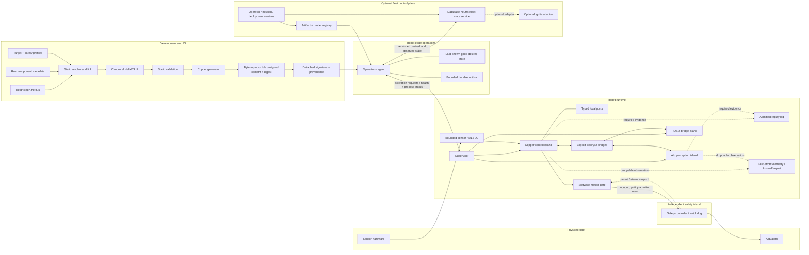
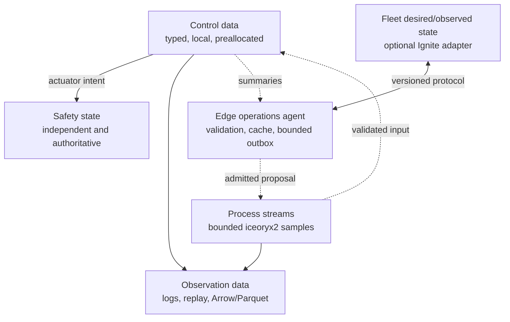

# Architecture Overview

HefaOS v2 separates build-time declarations, deterministic execution, best-effort robot services, fleet state, and independent safety. The separation is the architecture: no database, AI model, UI, recorder, bridge, or network service is allowed to become an undeclared control-loop dependency.

## Whole system



## Build path

```text
restricted *.hefa.ts + Rust package metadata + target profile
                         │
                         ▼
                canonical HefaOS IR
                         │
                         ▼
     type / unit / frame / clock / queue / timing /
     capability / resource / safety admission checks
                         │
                         ▼
           generated Copper graph and Rust wiring
                         │
                         ▼
       byte-reproducible content + digest + lockfiles
       + hashes + SBOM + target manifest
                         │
                         ▼
           detached signature + provenance attestation
```

The IR is inspectable build metadata, not runtime state. For identical complete declared inputs, the unsigned IR, generated source, and content bundle are byte-identical. Detached signatures and provenance attestations bind the same content digest but need not themselves be byte-identical. A backend receives only validated IR. If it cannot honor a required semantic, generation fails.

The selected frontend uses TypeScript syntax for parser, editor, and agent
compatibility, but accepts no JSX and executes no JavaScript. The HefaOS
frontend owns one canonical format and a repair-oriented validation loop:

```text
agent or human → *.hefa.ts → format → lint (text + JSON/SARIF)
                              ▲                 │
                              └──── repair ─────┘
                                                ▼
                                  semantic check → canonical IR
```

Generic TypeScript and editor tooling may provide early feedback, but only the
HefaOS checker can admit source because it also validates components, ports,
units, frames, timing, bounded queues, backend capabilities, cycles, and safety
authority.

## Robot data paths

### Deterministic control cycle

```text
admitted driver → typed sample → estimation → controller
               → software motion gate → bounded, policy-admitted intent
               → independent safety controller → actuator
```

This path uses local, preallocated messages and a monotonic clock. It does not call iceoryx2 unless a measured process boundary is essential, and it never calls a database, network service, filesystem, UI, ROS bridge, or AI model synchronously.

The software gate consumes a bounded permit/status/epoch from the independent controller. Missing, stale, or incompatible safety status prevents an actuator proposal from being admitted.

### AI/perception path

```text
loaned bounded sample → isolated model process → typed result
                      → freshness/confidence/policy checks
                      → deterministic graph or discard/fallback
```

The result includes source sequence, timestamps, model identity, confidence, and validity. Late or stale output is not “latest state”; it is rejected or handled by declared fallback. AI cannot bypass the software motion gate or independent safety controller.

### Fleet path

```text
fleet desired state → authenticated edge agent → local validation
                    → safe activation boundary → acknowledgement

runtime summaries → bounded outbox → batch/downsample → fleet service
```

Apache Ignite may back the fleet service, but the robot sees a versioned protocol, not database tables. Loss of network or Ignite retains the last valid deployment and durable configuration; the active mission's offline/degradation policy decides whether motion continues, pauses, or safely stops. Expired transient missions do not resume automatically.

### Evidence path

```text
required runtime evidence → qualified recording/replay facility

nonessential observations → bounded exporter → Arrow/Parquet / telemetry
```

The Copper recording/replay facility becomes an admitted HefaOS replay log only after Gate 0 qualifies its completeness, admission, and backpressure semantics. Required evidence may not be dropped silently; loss marks the run non-replayable or invokes its declared fault policy. The separate telemetry exporter may drop designated nonessential observations with counters and stays off the control path. Bit-identical replay may be claimed only for a pinned artifact and execution profile when all nondeterministic inputs, clock/ticks, drops, faults, and required task state are captured and restored. Otherwise, results use a declared numeric/semantic comparison and are labeled replay or counterfactual resimulation accordingly.

## Five state planes



There is deliberately no universal `StateStore` spanning these planes.

## Failure containment

The following behaviors apply to declared and tested user-space faults within the qualified resource-isolation envelope. Kernel, driver, interrupt, shared-resource, power, and other host-wide faults may still affect normal control and are handled by the independent safety controller.

| Failure | Required behavior |
|---|---|
| AI process crashes or GPU stalls | Controller integrity is preserved; the mission's degradation policy continues, pauses, or safely stops; supervisor restarts when allowed |
| ROS bridge crashes | Native control continues; bridge health becomes observed state |
| iceoryx2 queue/pool is exhausted | Declared edge overflow/fault policy executes; control never waits indefinitely |
| Replay log cannot accept required evidence | Run is marked non-replayable or its declared recording fault policy executes; loss is never hidden |
| Telemetry consumer stalls | Nonessential loss is counted; control is not blocked |
| Edge agent crashes | Current local deployment remains; transient commands still expire; no remote change activates |
| Network or Ignite is unavailable | Deployment/config remain local; mission degradation policy applies; outbox remains bounded |
| Control process hangs | Independent watchdog enters the robot-specific safe state |
| Old process reconnects after restart | Epoch mismatch rejects stale samples and acknowledgements |
| Deployment is interrupted | Existing signed artifact remains active or rollback completes atomically |
| Invalid/expired remote command arrives | Agent rejects it and records the reason |

## Trust boundaries

- `*.hefa.ts` and third-party packages remain contained, untrusted build inputs; validation and admission decide only whether their declared content may progress.
- Generated artifacts must be authenticated and policy-approved before activation and remain subject to target qualification and runtime safety enforcement; signatures prove origin and integrity, not safe behavior.
- Any AI, ROS, fleet, UI, or operator input that can influence actuation is non-authoritative and must pass deterministic local admission and independent safety enforcement.
- Processes sharing an OS user and shared memory are trusted peers but still resource-limited and supervised.
- The fleet network is hostile by default.
- The safety island is independent of normal application authority.

## What is reused versus built

| Layer | Initial choice | HefaOS responsibility |
|---|---|---|
| Deterministic execution | Copper | Generate valid applications, validate extra contracts, integrate provenance and tooling |
| Same-host process IPC | Copper iceoryx2 bridge, subject to Gate 0 version and capability qualification; otherwise one HefaOS adapter | Define bounded schemas, lifecycle, epochs, recording, and failure policy; never carry one edge over two buses |
| Analytical data | Arrow/Parquet | Asynchronous conversion and provenance |
| Replay and telemetry | Copper recording/replay facility, subject to Gate 0 admission and completeness qualification, plus a separate best-effort exporter | Define replay completeness, evidence loss, provenance, downsampling, and backpressure policy |
| Fleet persistence | Replaceable service; optional Apache Ignite | Desired/observed protocol, offline agent, identity, reconciliation, adapter |
| ROS ecosystem | Explicit sidecar mode | Schema/QoS/clock/frame mapping and isolation |
| AI runtimes | Pinned native/C-API adapters in isolated process | Lifecycle, resources, freshness, fallback, recording, safety policy |
| Physical safety | Target safety controller | Protocol, policy compilation, fault tests, evidence integration |

## Scope discipline

The initial product is one complete robot workflow, not a catalog of planned adapters. A custom scheduler, distributed state database, visual source editor, multiple simulators, broad board support, LLM actuation, and universal ROS compatibility remain excluded until the previous delivery gate has evidence.

See the [normative specification](specification.md), [review and limitations](limitations.md), and [delivery plan](../development/roadmap.md).
