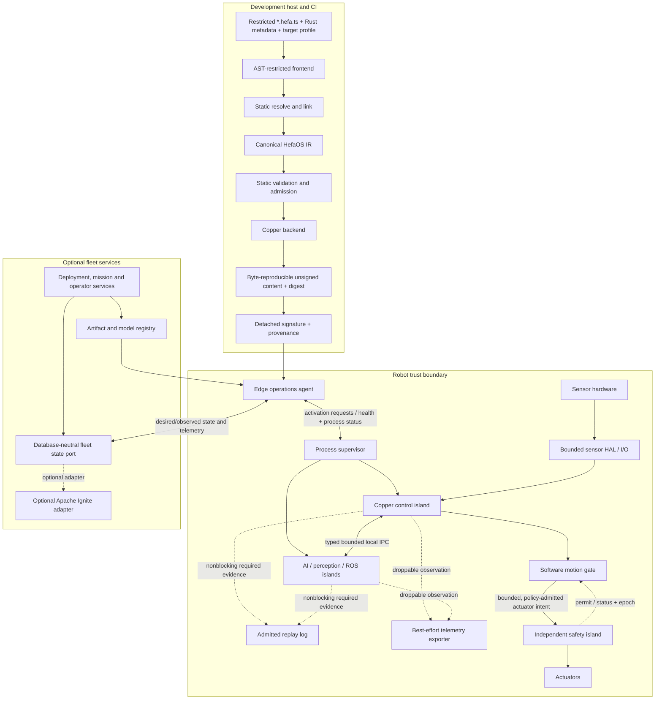

# HefaOS Architecture Specification

**Version:** 2.0 draft
**Date:** 2026-09-01
**Status:** Canonical draft; normative for v2 work
**Supersedes:** `hefaos-os-specification.md`, `hefaos-sdk-specification.md`, and `hefaos-dev-infrastructure.md` v1 drafts

The terms **MUST**, **MUST NOT**, **SHOULD**, **SHOULD NOT**, and **MAY** indicate requirement strength. A requirement is not implemented merely because it appears here.

## 1. Scope and system boundary

HefaOS is a robotics application platform layered over an execution backend and target operating system. It supplies a restricted authoring DSL, semantic IR, validation, artifact generation, runtime integration contracts, deployment, observability, safety-policy integration, and optional fleet services.

The initial target family is Linux with a Rust/Copper execution graph. No target is qualified until Gate 3 evidence exists. A future bare-metal or native HefaOS executor is outside the initial v2/pre-1.0 implementation roadmap unless a delivery gate explicitly admits it.

### 1.1 Timing classes

Every component and edge MUST belong to one timing class:

| Class | Intended use | Permitted dependencies | Claim level |
|---|---|---|---|
| Safety island | Emergency stop, STO, brakes, actuator limits, watchdog | Independent hardware/firmware and bounded physical link | Target-specific safety evidence only |
| Deterministic control | Sensor acquisition, estimation, control, software motion gate, actuator output | Preallocated local data, admitted drivers, monotonic clock with captured or virtualized replay semantics | Measured firm/soft real-time on qualified profiles |
| Replay evidence admission | Preallocated event capture and bounded handoff | Control-local admitted buffer with nonblocking drain | Completeness contract; required loss is explicit |
| Robot best effort | Perception, AI, ROS bridge, telemetry/export, UI, edge operations agent | Bounded IPC and normal OS services | No control-loop guarantee |
| Fleet control plane | Desired state, deployments, health summaries, coordination metadata | Authenticated network and replaceable services | Availability/consistency SLO, never real time |

Linux PREEMPT_RT, CPU affinity, `SCHED_FIFO`, Rust memory safety, or a percentile measurement MUST NOT be presented alone as proof of hard real time.

## 2. System architecture



### 2.1 Authority order

Authority MUST flow in this order:

1. Physical emergency controls and the safety island.
2. Deterministic local software motion gate.
3. Validated local mission and controller.
4. Best-effort AI, perception, ROS, and operator proposals.
5. Fleet desired state and cloud services.

A lower-authority layer MUST NOT bypass a higher-authority layer. AI, ROS, fleet services, and the edge agent MUST NOT write actuators directly.

## 3. Authoring model

### 3.1 Restricted declarative TypeScript (`*.hefa.ts`)

The sole initial HefaOS authoring frontend is a build-time structural profile
of TypeScript. Every authored application source file MUST match
`*.hefa.ts`. The compound suffix preserves ordinary TypeScript parser and
editor support while identifying the file as HefaOS input; ordinary `*.ts`
and all `*.tsx` files are not HefaOS v2 authoring inputs. JSX and TSX syntax
MUST be rejected.

The initial Gate 1 profile supports one project-manifest-selected root file,
static imports from compiler-owned virtual modules and catalogues whose exact
package versions and artifact digests are bound by the project lock, immutable
`const` declarations whose references form an acyclic
dependency graph, finite primitive literals, array and object literals,
object shorthand that references immutable bindings, unary minus on finite
numeric literals, `as const`, approved constructors, property selection and
calls on compiler-owned handles, explicit connections, and one default
application export. Local user module graphs, functions, classes,
conditionals, loops, comprehensions, spreads, generics, and other syntax are
outside the initial allowlist; adding one requires explicit grammar,
determinism, diagnostics, resource-limit, and canonicalization tests.

Shebangs, triple-slash references, `@ts-ignore`, `@ts-expect-error`,
`@ts-nocheck`, JSX/compiler pragmas, `sourceURL`, `sourceMappingURL`, and other
directive-like comments MUST be rejected. Ordinary comments MAY be retained
for review but are semantically inert and MUST NOT alter resolution,
diagnostics, or execution IR.

Restricted TypeScript MAY express:

- components and stable identifiers;
- typed input and output ports;
- graph connections;
- units, coordinate frames, clock domains, and rates;
- queue capacity, overflow, freshness, and fallback policies;
- resource and process placement requests;
- target capabilities;
- model manifests and non-authoritative AI contracts;
- safety-policy references;
- deployment variants and predeclared missions.

`*.hefa.ts` MUST NOT embed arbitrary runtime callbacks, promises, effects,
timers, dynamic imports, package lifecycle hooks, filesystem or process
access, network access, environment-dependent behavior, wall-clock reads,
randomness, `eval`, generated JavaScript, or direct hardware I/O. Runtime
behavior MUST resolve to a registered Rust component, an explicitly isolated
sidecar, or a future constrained expression/WASM profile.

The frontend MUST parse and walk a deny-by-default TypeScript AST. It MUST NOT
transpile, emit, import through Node.js, or execute user modules. Unknown AST
forms MUST fail closed. A future evaluator MAY execute code only inside a
separately threat-modeled, resource-bounded sandbox whose complete declared
inputs are captured; hashing an ambient side effect does not make it
acceptable.

JavaScript `number` MUST NOT represent precise `u64` identifiers or
timestamps. The initial profile MUST use typed constructors over canonical
decimal strings for those values. Finite `number` literals MAY represent
schema-bounded physical values where the component contract explicitly permits
them.

#### 3.1.1 Agent-first validation contract

Most `*.hefa.ts` source is expected to be produced or revised by coding agents
and reviewed by humans only at selected boundaries. The source therefore MUST
remain explicit and human-auditable, but the primary feedback contract is a
deterministic tool protocol rather than stylistic convention.

Before Gate 1 completes, the planned `hefaos` CLI MUST expose:

- `hefaos fmt --check` for one canonical, idempotent source format;
- `hefaos lint --format sarif --deny-warnings` and a versioned JSON equivalent
  for file discovery, the source-profile allowlist, directive/import policy,
  precise numeric representation, and other checks that do not require
  catalogue resolution;
- `hefaos check --format sarif --deny-warnings` and a versioned JSON equivalent
  for complete catalogue resolution plus component, port, type, unit, frame,
  graph, timing, queue, resource, backend-capability, cycle, and safety
  validation without backend generation;
- `hefaos build --reproducible` for hermetic lowering and artifact generation.

These commands are a planned Gate 1 contract, not a claim that the current
legacy TypeScript scaffold implements them. Generic `tsc`, ESLint, and editor
diagnostics MAY provide early assistance but MUST NOT admit HefaOS source.

Every HefaOS diagnostic MUST have a stable rule code, severity, normalized
project-relative path and source span, deterministic ordering, concise message,
and remediation help. Related spans and a machine-applicable fix MAY be
included. A fix is safe only when the formatter/checker proves that it does not
change an existing canonical execution-IR digest. If the pre-fix source cannot
produce valid IR, the diagnostic MAY provide remediation text but MUST NOT
provide a machine-applicable fix. Safety, authority, timing, queue, freshness,
resource, or fallback policy MUST NOT be invented or changed by an automatic
fix. CI MUST reject checked-in warnings until a rule-specific policy explicitly
permits one.

Parsing and checking MUST enforce declared limits for source bytes, AST nodes
and depth, import count and depth, diagnostics, CPU time, and memory. Exceeding
a limit MUST fail closed with a stable diagnostic. Agent authorship MUST NOT be
encoded as `*.gen.ts` or change semantics; authorship and tool provenance
belong in detached build records.

### 3.2 Rust components

In-process HefaOS runtime algorithms, drivers, transforms, controllers, and Copper adapters MUST be Rust crates with machine-readable HefaOS component metadata. Isolated Java, C++, C, or other sidecar services MAY be used behind versioned IPC or authenticated APIs when an official dependency surface requires them. Metadata MUST declare:

- component and package version;
- input/output schemas and stable type IDs;
- lifecycle and state-serialization support;
- timing class and blocking/allocation constraints;
- resource and device requirements;
- supported targets and backend capabilities;
- configuration schema and defaults;
- unsafe/FFI surface and required native libraries;
- license and provenance.

Unsafe code SHOULD be isolated behind small audited modules. C/C++ vendor SDKs MAY be used through isolated FFI adapters, but MUST NOT make C++ a co-equal runtime target in the initial architecture.

Rust `build.rs`, procedural macros, native build scripts, and package-manager lifecycle hooks execute code during a build. Reproducible builds MUST therefore run in a network-denied sandbox with declared inputs, pinned dependencies, restricted credentials, and captured toolchain/provenance—not rely only on frontend restrictions.

## 4. HefaOS IR

### 4.1 Purpose

The HefaOS IR is the source of truth between authoring and all generators. It is build-time data and MUST NOT be used as the hot-path runtime representation.

### 4.2 Required content

The IR MUST include:

- `schemaVersion` and compiler compatibility range;
- application, target, robot, and deployment identities;
- stable component, port, schema, resource, process, and graph IDs;
- typed ports, units, dimensions, coordinate frames, and clock domains;
- producer/consumer cardinality and arbitration rules;
- queue capacity, history, overflow, freshness, and validity behavior;
- task release, rate, end-to-end deadline, fallback, and timing class;
- resource ownership, CPU/process placement, memory and accelerator budgets;
- safety invariants, actuator authority, watchdogs, and safe-state references;
- AI model, preprocessing, postprocessing, confidence, TTL, and fallback metadata;
- recording and replay classification;
- backend capability requirements and extension namespaces;
- resolved artifact, dependency, model, configuration, and target digests that
  affect execution semantics.

Source spans and frontend/toolchain provenance MUST NOT perturb the canonical
execution IR. A detached source-map artifact MUST bind source digests and
semantic node IDs to source spans. A detached build-provenance artifact MUST
bind the IR digest to the frontend, formatter, validator, toolchain, catalogue,
and declared input versions. Both artifacts are integrity-protected alongside
the IR, but formatting, comment, authorship, or path changes that preserve
semantics MUST leave the execution-IR digest unchanged.

### 4.3 Canonical form and evolution

The first representation SHOULD be canonical JSON validated by a published JSON Schema. Canonicalization MUST define key ordering, numeric representation, Unicode handling, defaults, and stable ID construction. Identical declared inputs MUST produce byte-identical IR.

Every generated artifact MUST reference the IR digest. Schema evolution MUST provide compatibility rules and explicit migrations. Unknown mandatory fields or capabilities MUST fail closed. Extensions MUST use namespaced identifiers and MUST declare whether they affect execution semantics.

Secrets MUST NOT appear in IR or generated source. Artifact manifests MAY refer to secret slots resolved by the target deployment system.

### 4.4 Capability negotiation

Each backend and target profile MUST publish capabilities. The compiler MUST compare required IR semantics against those capabilities before generation.

The compiler MUST reject, rather than approximate silently:

- unsupported release or deadline semantics;
- unsafe multi-rate joins;
- unrepresentable queue or overflow behavior;
- unavailable clock domains or synchronization quality;
- unsupported task-state replay;
- invalid process placement or resource isolation;
- missing safety or actuator capabilities;
- payloads that violate target or IPC bounds.

Backend-specific extensions are permitted only through namespaced IR fields with explicit portability impact.

The planned machine-readable backend capability profiles and the planned
`execution-backend/v1` conformance inventory are constrained by the subordinate
[execution backend capability and conformance contract](execution-backend-contract.md).
That contract defines the semantic inventory, evidence shape, and fail-closed
profile rules for future schema and backend work; it does not describe an
implemented backend profile or broaden current backend support.

## 5. Backend architecture

### 5.1 Copper backend

Copper is the sole initial deterministic execution backend. The adapter MUST use Copper’s public application/configuration contract and SHOULD generate inspectable configuration and Rust wiring rather than patch Copper internals.

The adapter is responsible for:

- mapping HefaOS components and ports to Copper tasks and messages;
- generating static graph and mission configuration;
- mapping supported rates, resources, background work, monitoring, and recording;
- attaching IR, schema, model, and artifact provenance;
- emitting source-mapped diagnostics for unsupported semantics;
- generating a reproducible Cargo build and deployment entry point.

HefaOS MUST pin a supported Copper version in the lockfile, publish a compatibility policy, and test the pinned and newest supported versions in CI. License notices and required attribution MUST ship in deployment artifacts.

Where Copper already provides a public bridge, logging, replay, simulation, resource, or lifecycle facility, HefaOS SHOULD adapt or contribute to it instead of building a parallel mechanism. In particular, an available supported Copper/iceoryx2 bridge SHOULD be evaluated before introducing a HefaOS-specific IPC runtime.

Copper's whole-loop rate limiter MUST NOT be interpreted as proof of arbitrary per-task release, deadline, WCET, or miss-policy semantics. HefaOS MUST measure and capability-check the exact supported release.

### 5.2 Backend conformance

A backend is supported only when it passes a conformance suite covering:

- type and topology validation;
- rate/release semantics;
- queue, overflow, and freshness behavior;
- monotonic clock behavior;
- fault propagation and task lifecycle;
- recording and deterministic replay classification;
- process-boundary behavior;
- artifact provenance and reproducibility.

Output equality across different backends is not assumed. The conformance suite checks declared semantic contracts.

### 5.3 Native backend decision gate

A custom HefaOS executor MUST NOT enter the roadmap until a real user requirement cannot be met by Copper. The proposal MUST include:

- the missing semantic or target capability;
- a minimal reproduction against the supported Copper version;
- measured impact on a named workload;
- estimated lifecycle and safety burden;
- proof that extending or contributing to Copper is insufficient.

## 6. Robot execution model

### 6.1 Execution islands

An execution island is an independently supervised process with one executor, local task state, resource budget, restart epoch, and declared ingress/egress edges.

The initial system SHOULD use the fewest islands that meet fault-containment and resource requirements:

- one deterministic Copper control island;
- optional non-real-time AI/perception island;
- optional ROS 2 bridge island;
- edge operations agent;
- admitted replay-log emission at the control boundary plus a bounded non-real-time replay drain;
- a separate best-effort telemetry exporter, which MAY be integrated with a non-real-time island only while its backpressure contract remains distinct from replay admission;
- independent safety controller outside ordinary process authority.

Splitting every task into a process is prohibited. A new boundary requires measured or safety-driven justification because IPC, supervision, memory pools, and replay all add complexity.

### 6.2 Critical-path rules

Within the admitted control phase:

- memory MUST be preallocated;
- blocking network, database, filesystem, console, and unbounded device operations are forbidden;
- general async runtimes and work stealing are forbidden;
- locks require a bounded, reviewed protocol and SHOULD be avoided;
- logging MUST use preallocated or offloaded mechanisms;
- every input MUST have freshness and invalid-data behavior;
- every task failure, panic, overrun, and unavailable output MUST map to a declared policy;
- all actuator output MUST pass through the local software motion gate.

Tooling MUST verify what it can statically and measure the remainder. Rust does not by itself prove absence of allocation, blocking, jitter, or unbounded FFI behavior.

### 6.3 Scheduling semantics

Graphs are static within a deployed mission. Runtime graph mutation is prohibited in the initial release. Switching among precompiled missions MAY occur only at declared safe transition points.

The IR MUST distinguish:

- release period and phase;
- relative and end-to-end deadlines;
- input sampling policy: latest, queued, synchronized set, or exact sequence;
- permitted age and clock domain;
- overrun policy;
- task criticality and fallback.

The Copper adapter MAY lower harmonic rates onto an admitted base cycle when the resulting sample semantics are explicit. Unsupported non-harmonic rates, ambiguous joins, or impossible admission MUST fail compilation.

No task is assumed safely preemptible. Deadline monitoring observes and reacts; it does not create a hard guarantee.

### 6.4 Qualified Linux profile

A target that claims a measured latency envelope SHOULD define:

- dedicated control CPUs and separate housekeeping CPUs;
- IRQ and per-CPU kernel-thread affinity away from control CPUs;
- recorded firmware/BIOS version, SMT policy, CPU-frequency governor, C-state policy, clocksource, and relevant firmware-SMI conditions;
- locked and prefaulted memory plus explicit memory limits;
- required scheduling, affinity, and `memlock` privileges;
- priority-inheritance synchronization when blocking cannot be eliminated;
- AI, ROS, fleet, network, storage, and ordinary logging threads excluded from control CPUs;
- production panic behavior and allocation enforcement;
- sustained `rtla`/cyclictest and full-application deadline tracing under representative I/O, CPU, memory, network, storage, accelerator, power, and thermal load.

Qualification MUST publish maximum observed latency and missed-deadline counts in addition to percentiles. A synthetic kernel-latency test alone does not qualify the application.

### 6.5 Queue and overload rules

Every queue MUST have a finite capacity and one overflow policy: reject producer output, drop newest, drop oldest, replace latest, or transition to fault. The chosen policy MUST be valid for the edge’s criticality.

Loss counters, last-valid sequence, and freshness MUST be observable. Critical command edges MUST NOT silently drop or reorder values. Backpressure from recording, telemetry, UI, AI, ROS, or fleet services MUST NOT propagate into the control island.

## 7. State and data planes

### 7.1 Control data

Control data consists of typed task messages and task-private state. It MUST be process-local, preallocated for the admitted cycle, and reachable only through declared ports or task ownership. There is no universal mutable `StateStore` API in a deterministic island.

A read-only introspection snapshot MAY be published asynchronously. It MUST NOT become a hidden control dependency.

### 7.2 Process data with iceoryx2

iceoryx2 is the preferred local interprocess transport when a process split is justified. Its use MUST specify:

- service and schema identity;
- bounded payload and alignment;
- publisher and subscriber limits;
- queue depth and history;
- overflow and connection behavior;
- loan lifetime and ownership recovery;
- incompatible version handling;
- process death, restart, and stale-sample handling;
- memory-pool budget and exhaustion response.

Shared-memory payloads MUST be self-contained and layout-stable. They MUST NOT contain ordinary heap pointers, `String`, `Vec`, process-local handles, or destructors. Fixed-size or shared-memory-compatible containers MAY be used. Large variable data SHOULD use an iceoryx2-managed bounded or dynamically sized loaned payload with fixed metadata where the selected pattern is supported. External GPU or DMA buffer handles require separately qualified transport, ownership, and lifetime semantics.

iceoryx2 is local IPC, not network transport, scheduling, storage, or safety authority.

Processes connected through shared memory are treated as trusted peers, not mutually hostile tenants. Permissions MUST be restricted to the intended runtime identity, but the architecture MUST NOT rely on iceoryx2 alone as a strong security boundary against a compromised peer.

Thread-safe port variants and shared-memory-to-GPU/NPU paths MUST be benchmarked rather than assumed lock-free or copy-free. The initial architecture assumes explicit staging copies for accelerator buffers unless a target-specific zero-copy path is qualified.

For a given cross-island edge, HefaOS MUST use a supported Copper iceoryx2 bridge when it meets this contract; otherwise it MAY supply one HefaOS iceoryx2 adapter. Two local buses or duplicate transports MUST NOT carry the same logical edge.

### 7.3 Replay evidence and best-effort observation

Replay-critical recording and best-effort telemetry are separate flows. The admitted replay log MUST preserve every input, event, drop, fault, tick, and task-state transition required by the declared replay contract. If required evidence is lost, the run MUST be marked non-replayable or execute its declared recording fault policy; loss MUST NOT be hidden.

The telemetry exporter MAY downsample or drop designated nonessential observations with explicit counters and MAY transform them into Arrow and Parquet outside the critical path. Every recording MUST identify:

- IR and deployment artifact digest;
- component, model, configuration, and target versions;
- boot/session epoch and clock metadata;
- sequence, drops, faults, and quality flags;
- simulation seed and external-input capture status;
- whether each source is deterministic, captured nondeterministic, or unavailable.

The system MUST distinguish telemetry playback, deterministic executor replay, and counterfactual resimulation. Telemetry availability MUST NOT be mistaken for replay completeness. Every replay claim MUST name its pinned artifact, execution profile, and equality contract. Bit-identical replay MAY be claimed only when all nondeterministic inputs, clock/ticks, drops, faults, and required task state are captured and restored; otherwise the contract MUST define numeric or semantic comparison.

### 7.4 Fleet desired and observed state

Fleet state is asynchronous and MUST be separated into desired and observed records. A remote mutation envelope MUST carry, as applicable:

- robot identity and boot/deployment epoch;
- monotonic revision and command ID;
- issued-at time and expiry;
- idempotency key;
- issuer identity, authorization, and signature;
- expected prior revision or fencing/lease token;
- acknowledgement, result, and rejection reason.

The robot is authoritative for local safety and activation. It MUST reject stale, expired, unauthorized, conflicting, or invalid state. During disconnection it retains its last validated deployment and durable configuration, while each mission's explicit offline/degradation policy decides whether current motion continues, pauses, or safely stops. Expired transient commands and missions MUST NOT be resumed automatically after reconnection.

## 8. AI model contract

AI is initially non-authoritative and runs outside the deterministic control phase. Each model deployment MUST declare:

- model, preprocessing, postprocessing, and runtime hashes;
- accepted input schema, dimensions, units, frames, and age;
- accelerator, memory, warm-up, concurrency, and queue budgets;
- measured latency envelope on the target profile;
- timeout, maximum output age, confidence threshold, and validity checks;
- deterministic fallback and safe degradation;
- recording policy for inputs, outputs, and nondeterministic metadata;
- activation, probation, rollback, and compatibility policy.

Late results MUST be discarded or handled according to declared policy. GPU or model-runtime preemption MUST NOT be assumed. Hot swapping in a control island is prohibited; model changes use signed, versioned deployment activation.

LLM output MUST be parsed into a closed typed proposal schema, checked against the current world-state revision and allowed authority, validated by deterministic policy, and audited. An LLM MUST NOT directly emit actuator commands.

## 9. Hardware and simulation

### 9.1 HAL contracts

HAL traits SHOULD describe capabilities rather than pretend hardware is uniform. Target profiles MUST bind logical resources to driver crates and declare:

- bus/device identity and ownership;
- supported rates and timestamp source;
- bounded I/O behavior and failure modes;
- units, coordinate frames, calibration, and limits;
- safe initialization, shutdown, reconnect, and reset;
- unsafe/FFI and vendor-library dependencies.

The same source and IR MAY be rebuilt for multiple qualified target profiles. HefaOS MUST NOT promise the same binary across arbitrary ARM boards.

### 9.2 Simulation parity

Simulation and hardware SHOULD consume the same validated IR and task graph. Backend-specific drivers MAY differ. HAL conformance and recorded-trace tests MUST expose differences in timing, units, frames, saturation, dropout, noise, and restart behavior.

Hot reload is simulation-only in the initial architecture. Structural, model, driver, and safety changes on hardware require a signed deployment and safe activation boundary.

## 10. Safety architecture

HefaOS provides mechanisms for safety engineering; it is not itself a certification.

### 10.1 Independent safety island

The safety island MUST independently enforce or transition to the robot-specific safe or degraded response when Linux, Copper, AI, IPC, the GPU, the fleet network, or the edge agent fails; it need not preserve normal actuation. Depending on the robot, it MAY be a safety MCU, certified controller, drive-level STO, or combination.

Its protocol MUST define:

- packed wire representation and endianness;
- monotonic command sequence and controller epoch;
- command freshness/TTL and watchdog timing;
- integrity and, where applicable, authenticity/replay protection;
- bounded actuator intent and enforced physical limits;
- application-specific safe and degraded states;
- reset authority, interlocks, and controlled restart;
- firmware identity, update, rollback, and independent test evidence.

“Cut power immediately” MUST NOT be the universal safe-state assumption. Loads, brakes, gravity, and stored energy require target-specific hazard analysis.

### 10.2 Software motion gate

The software motion gate is part of the Copper control island and executes after control computation. All actuator intent MUST pass through this deterministic local gate, which checks freshness, mode, limits, current safety state, and authority before producing a bounded, policy-admitted actuator intent for the independent controller. The independent controller MUST return a bounded permit/status/epoch signal; missing, stale, or incompatible status prevents admission. This software gate does not by itself establish physical safety; the independent controller retains final enforcement authority. Any AI, ROS, fleet, or operator input that can influence actuation is non-authoritative until admitted by this gate and the independent safety island.

## 11. Time, identity, and replay envelopes

Every runtime sample crossing a task or process boundary MUST carry or inherit:

- source and schema ID/version;
- boot/session epoch;
- monotonically increasing sequence;
- monotonic timestamp and clock-domain ID;
- optional synchronized wall/TAI time plus uncertainty;
- validity, stale, estimated, dropped, and fault flags;
- payload length for bounded variable data.

Wall time MUST NOT drive local deadlines. Cross-robot time assumptions require an explicit synchronization profile and uncertainty budget.

On restart, a new epoch MUST prevent old shared-memory samples, fleet commands, and acknowledgements from being mistaken for current data.

## 12. Edge operations and fleet state

### 12.1 Edge operations agent

The edge agent is non-real-time and MUST be isolated from actuator authority. It provides:

- signed deployment download and verification;
- atomic activation and rollback;
- last-known-good desired-state cache;
- observed-state and health publication;
- telemetry batching with bounded local outbox;
- command validation, idempotency, acknowledgement, and expiry;
- offline operation and reconciliation;
- device identity and authenticated control-plane connection.

Within the declared and tested user-space fault and resource-isolation envelope, agent failure or network loss MUST NOT block or corrupt control execution. Host-wide, kernel, driver, and hardware faults remain the independent safety controller's responsibility. This independence does not imply indefinite motion: the active mission's offline/degradation policy MAY continue a locally autonomous task, pause, hold, return, or enter a robot-specific safe state. The agent MUST NOT reactivate expired transient commands after restart or reconnection.

### 12.2 Fleet state port and Apache Ignite

Fleet persistence MUST be accessed through a database-neutral service port. Apache Ignite 3 is an optional adapter, not a required robot dependency.

An Ignite adapter MAY store:

- current desired and observed robot state;
- deployment, configuration, calibration, and model metadata;
- mission ownership, leases, and coordination records;
- searchable health summaries and audit indexes.

It SHOULD NOT store raw high-rate images, point clouds, or full telemetry streams. Those belong in a bounded event/object-storage path and analytical formats.

No Ignite client, transaction, cluster call, JVM, or retry loop may execute in a deterministic island. Until a supported Rust client is qualified, integration SHOULD run through a separate service using an officially supported client and a versioned authenticated API.

## 13. ROS 2 interoperability

ROS 2 support is an optional bridge island. Each supported interface MUST define:

- message/schema conversion and copy behavior;
- QoS reliability, durability, history, depth, and deadline mapping;
- clock and `/clock` semantics;
- TF/frame and unit mapping;
- namespaces, remapping, parameters, lifecycle, services, and actions as applicable;
- bounded queues, restart, stale data, and failure behavior;
- rosbag or recording interoperability;
- supported ROS distribution and bridge implementation.

The bridge MUST NOT be represented as preserving deterministic control timing. Replacing ROS 2 DDS with legacy `rmw_iceoryx` is not a required migration phase.

The first bridge MUST pin one ROS 2 distribution and one explicitly named implementation mode. `rclrs` currently carries API/stability risk, while `rmw_zenoh` and `zenoh-bridge-ros2dds` are distinct integration approaches with different wire and discovery semantics; they MUST NOT be presented as interchangeable. Cross-distribution schema/type-hash behavior requires an explicit compatibility test.

## 14. Security and supply chain

Before remote deployment or fleet control is called implemented, HefaOS MUST define and test:

- unique device and operator identity;
- mutually authenticated encrypted control-plane channels;
- role- and capability-based authorization;
- signed IR, binaries, models, policies, and target manifests;
- secure key storage where supported;
- anti-rollback policy and atomic recovery;
- secrets injection that excludes secrets from IR, logs, and images;
- dependency locks, SBOM, license inventory, vulnerability policy, and provenance;
- audit records for deployment, command, reset, mission, and model activation;
- least-privilege process, device, shared-memory, and filesystem permissions.

World-writable shared memory and unauthenticated E-stop reset are prohibited.

## 15. Observability and evidence

The system SHOULD expose one correlated timeline across task execution, queues, IPC, model inference, safety transitions, deployments, and fleet commands. Observation MUST be offloaded or bounded so that consumers cannot stall control.

Performance reports MUST identify:

- exact source and dependency revisions;
- hardware, firmware, kernel, target profile, compiler, and power/thermal mode;
- workload, payloads, graph, rates, logging level, competing load, and duration;
- sample count, p50, p95, p99, p99.9, maximum observed latency, jitter, and misses;
- CPU, memory, shared-memory pool, and accelerator use;
- raw result artifact and reproduction commands.

HefaOS-generated Copper MUST be compared with direct Copper to measure generator/runtime overhead. ROS 2/RobotPerf comparisons MUST use equivalent semantics and named configurations. Taste and developer-experience studies MUST be separated from runtime benchmarks.

## 16. Repository and build target

The planned repository shape is:

```text
hefaos/
├── compiler/                 # restricted *.hefa.ts frontend, IR and validators
├── sdk/                      # TypeScript authoring packages
├── runtime/
│   └── crates/
│       ├── hefaos-core       # common contracts and envelopes
│       ├── hefaos-copper     # Copper backend and runtime integration
│       ├── hefaos-ipc        # iceoryx2 bridge contracts
│       ├── hefaos-hal        # HAL traits and target bindings
│       ├── hefaos-ai         # model contracts and isolated adapters
│       ├── hefaos-safety     # software-gate and safety-link contracts
│       ├── hefaos-record     # recording and export
│       └── hefaos-agent      # non-real-time edge operations agent
├── fleet/                    # database-neutral services and optional adapters
├── simulator/                # simulation integration
├── targets/                  # board/kernel/device profiles
├── examples/                 # proving vertical slices
├── tests/                    # conformance, replay, fault and benchmark suites
└── docs/
```

The Rust toolchain, Copper version, TypeScript parser/type declarations,
frontend, formatter, linter, Node/pnpm toolchain where still required, schemas,
catalogues, models, and native dependencies MUST be locked. Clean-checkout
builds MUST use documented commands and MUST NOT swallow generator, formatter,
linter, schema, or test failures.

The current C++ `runtime/` and TypeScript-to-C++ compiler are superseded scaffolding. Their deletion or archival occurs as a deliberate implementation migration, not as evidence that Rust components already exist.

## 17. Verification requirements

The test system MUST include, as each feature appears:

- IR schema, canonicalization, migration, and golden tests;
- positive and negative discovery tests proving that only `*.hefa.ts` is
  admitted as v2 authoring source;
- formatter golden, cross-host byte equality, and `fmt(fmt(x)) == fmt(x)`
  idempotence tests;
- forbidden-AST, hermetic-evaluation, malicious-input, and source, AST,
  import, diagnostic, CPU, and memory limit tests;
- golden diagnostics covering stable rule codes, relative spans, deterministic
  order, JSON/SARIF schemas, related locations, and safe fixes;
- proof that every machine-applied fix starts from valid source and preserves
  its execution-IR digest; invalid source receives help but no automatic fix;
- source-map and provenance tests proving that comments, formatting, source
  paths, and authorship do not perturb the semantic IR;
- source-mapped semantic diagnostics for unknown components and ports, type,
  unit and frame mismatch, unsafe cycles, queue/freshness errors, and
  unsupported backend capabilities;
- backend semantic conformance;
- generated-build clean-room tests;
- Rust unit, property, fuzz, concurrency, unsafe/FFI, and target compilation tests;
- simulation end-to-end and deterministic replay tests;
- stale, missing, duplicated, reordered, corrupt, and incompatible sample tests;
- process crash, hang, restart, pool exhaustion, and backpressure tests;
- target timing and sustained-load tests;
- safety-controller protocol and fault-injection tests;
- signed deployment, interrupted update, rollback, and authorization tests;
- disconnected fleet operation and idempotent reconciliation tests;
- AI timeout, stale result, bad confidence, GPU stall, and fallback tests;
- scoped ROS QoS, clock, frame, restart, and conversion tests.

Unconditional placeholder tests and ignored tool failures are prohibited in release gates.

## 18. Open decisions

The following remain unresolved and MUST be settled by evidence in the delivery plan:

- the exact supported Copper release and adapter surface;
- canonical JSON library and stable-ID algorithm for IR;
- component registry and package-signing design;
- admissible multi-rate lowering rules;
- first robot, target board, kernel, simulator, and real driver;
- target safety-controller hardware and wire protocol;
- local durable outbox implementation;
- initial ROS 2 distribution and bridge mechanism;
- whether fleet scale ever justifies Apache Ignite;
- model runtime for the first isolated perception example;
- criteria and ownership for any future native executor.

No unresolved item may be converted into a broad product claim.

## 19. Primary external references

- [Copper Runtime & SDK](https://github.com/copper-project/copper-rs)
- [Copper configuration model](https://copper-project.github.io/copper-rs/Copper-RON-Configuration-Reference/)
- [Eclipse iceoryx2](https://github.com/eclipse-iceoryx/iceoryx2)
- [iceoryx2 shared-memory fundamentals](https://ekxide.github.io/iceoryx2-book/main/fundamentals/shared-memory.html)
- [Apache Ignite 3 client overview](https://ignite.apache.org/docs/ignite3/latest/developers-guide/clients/overview)
- [Apache Ignite transaction model](https://ignite.apache.org/docs/ignite3/latest/developers-guide/transactions)
- [ROS 2 documentation](https://docs.ros.org/)
- [RobotPerf benchmarks](https://github.com/robotperf/benchmarks)
