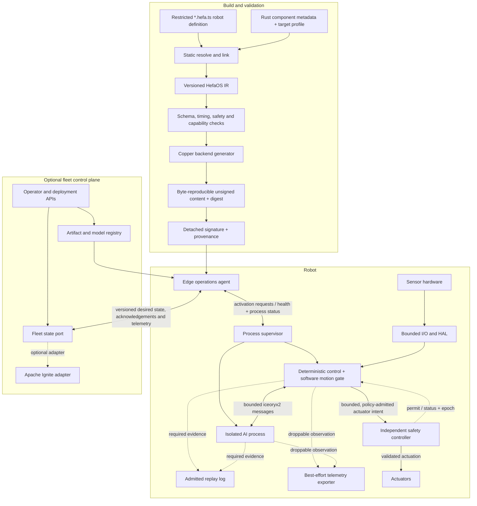

# HefaOS Concept

**Version:** 2.0 draft
**Date:** 2026-09-01
**Status:** Canonical draft product concept
**Implementation status:** Architecture and scaffolding; not yet an end-to-end runtime

## One-sentence definition

HefaOS is an AI-aware robotics application platform designed to compile restricted declarative TypeScript robot definitions from `*.hefa.ts` files and resolved Rust component metadata into validated deployment content for evidence-scoped deterministic robot execution and safety-governed fleet operation.

The name says “OS,” but HefaOS is not a kernel. It is initially designed for Linux and coordinates existing runtime, IPC, simulation, AI, and fleet technologies behind one development model. Any other embedded target requires explicit backend and target qualification.

## The problem

Robotics teams repeatedly assemble the same disconnected layers:

- hardware drivers and control loops;
- task graphs and behavior logic;
- simulation and recorded-data replay;
- AI model packaging and inference processes;
- deployment, monitoring, configuration, and fleet state;
- safety policies that are often implicit in application code.

Fast runtimes already exist. HefaOS does not win by creating one more scheduler. It wins if a robot can be described once, checked before deployment, run through a pinned backend whose timing and replay semantics are qualified for the named target, observed as one system, and governed by explicit degradation and safety policies when AI, networking, or fleet services fail.

## Product boundary

HefaOS owns:

- the restricted `*.hefa.ts` authoring model;
- a versioned, language-neutral HefaOS IR;
- schema, unit, coordinate-frame, resource, timing, and safety validation;
- backend capability negotiation and artifact generation;
- Rust component, driver, and model contracts;
- simulation, deployment, observability, and replay workflows;
- the edge operations agent and optional fleet-state adapters.

HefaOS does not initially own:

- a new production scheduler;
- a Linux distribution or kernel;
- a distributed database;
- a general-purpose message broker;
- a physics engine;
- a safety certification claim;
- arbitrary runtime execution of TypeScript on a robot.

## Strategic decisions

| Decision | Rationale | Consequence |
|---|---|---|
| Rust is the systems language | Memory safety, strong types, traits, Cargo, and ARM support fit the intended runtime | The current C++ scaffold is legacy and must not be ported literally |
| Copper is the sole initial execution backend | Copper already supplies a static Rust task graph, generated execution, recording, and deterministic replay | HefaOS focuses on the missing platform layer and proves value sooner |
| The HefaOS IR is backend-neutral but capability-aware | A stable contract preserves future options without promising false portability | Unsupported semantics fail compilation instead of silently degrading |
| `*.hefa.ts` is the sole initial authoring profile | TypeScript syntax is familiar to coding agents and human reviewers; TSX/JSX and arbitrary Node.js execution add no required graph semantics | The planned frontend parses a deny-by-default declarative AST, while runtime algorithms live in registered Rust components |
| Authoring is agent-first and lint-gated | Agents benefit from deterministic formatting and structured repair feedback more than stylistic flexibility | HefaOS owns stable diagnostic codes, source spans, JSON/SARIF output, semantic checks, and reproducible lowering; generic TypeScript tools are advisory |
| Local typed messages are the control-path state model | Explicit ports preserve dependency visibility and bounded execution | There is no mutable global Arrow, Ignite, or reactive state store in a real-time loop |
| iceoryx2 is local interprocess transport | It provides Rust-native, shared-memory, zero-copy-capable IPC for deliberate process boundaries | Payloads must be bounded and shared-memory compatible; IPC is not a scheduler |
| Apache Ignite is an optional fleet-state adapter | SQL, transactions, and distributed state are useful above the robot | Ignite is never required for control, never called from a critical path, and may be replaced |
| Arrow and Parquet are telemetry/export formats | Columnar data is valuable for analysis and training | Conversion happens outside the critical path and is not described as zero-copy control state |
| ROS 2 is a migration boundary | Existing drivers and tools matter for adoption | Compatibility runs through a bridge process and is not part of the deterministic core |
| Safety is independently enforced | Software and AI failures must not defeat actuator limits or emergency stop | A safety MCU or equivalent independent controller owns final actuation authority |

## Agent-first authoring workflow

HefaOS expects coding agents to create and revise most application graphs,
while humans review intent, safety boundaries, and exceptional changes. This
does not make the source disposable: `*.hefa.ts` remains the reviewable source
of declared intent, uses one canonical format, and avoids a separate `.gen.ts`
class. Authorship and tool provenance are detached build evidence.

The normal repair loop is generate → format → lint → repair → semantic check →
canonical IR. Diagnostics must be deterministic and available as concise human
text plus versioned JSON/SARIF with stable rule codes and source spans. Generic
TypeScript tooling is helpful but insufficient because it cannot validate
robot-specific units, frames, timing, bounded queues, backend capabilities,
cycles, or actuator authority.

The accepted cost is a custom HefaOS allowlist, formatter, semantic checker,
diagnostic compatibility policy, and resource-bounded parser. TypeScript is
selected for the initial frontend; JSX/TSX is rejected, while KCL, Starlark,
and other authoring languages are deferred rather than promised as
compatibility targets.

## Architecture at a glance

## Five state planes

The word “state” previously hid incompatible consistency and timing requirements. HefaOS separates five planes:

1. **Control data plane:** preallocated, typed values and messages inside one deterministic graph. It uses monotonic time and never depends on networking or a database.
2. **Process data plane:** bounded samples crossing a deliberate process boundary through iceoryx2. Every queue has capacity, freshness, and overflow policy.
3. **Observation plane:** an admitted replay log preserves required evidence or marks the run non-replayable; a separate best-effort path may lose or downsample nonessential metrics and Arrow/Parquet exports but must report loss.
4. **Fleet state plane:** desired state, robot summaries, configuration versions, deployment metadata, and digital twins. It is asynchronous and optional; Apache Ignite is one adapter.
5. **Safety plane:** independent watchdogs, limits, emergency stop, and safe-state transitions. It remains authoritative if every other plane fails.

No plane is allowed to masquerade as another. In particular, a fleet database update is not an actuator command, an IPC channel is not a state database, and an analytical table is not a control-loop buffer.

## User workflow

1. An agent or developer declares robot composition, typed connections, rates, deadlines, resources, model contracts, and safety policies in restricted `*.hefa.ts` source.
2. Performance-critical behavior, drivers, and adapters are implemented as Rust crates with HefaOS metadata.
3. The compiler produces canonical HefaOS IR and validates types, units, frames, graph topology, resource budgets, backend capabilities, and safety invariants.
4. The Copper backend generates the executable graph and deployment manifest.
5. Simulation and recorded-input replay exercise the same generated graph before hardware deployment.
6. A byte-reproducible content bundle is identified by digest, then a detached signature and provenance attestation authorize deployment with an atomic rollback path.
7. The robot runs independently of the fleet plane. Desired-state changes are versioned, validated locally, acknowledged, and activated only at a declared safe boundary.

## Relationship to Copper

Copper is an execution engine and the initial quality bar. HefaOS is the build, validation, integration, safety-policy, AI-lifecycle, deployment, and operations layer around that engine.

HefaOS must not duplicate Copper features under different names. It should contribute or adapt when Copper already provides the required execution semantics. A future native HefaOS backend is justified only if measured requirements cannot be expressed or met through Copper and the difference is demonstrated by a conformance test and benchmark.

## Defensible differentiation

HefaOS is meaningfully different only if it delivers:

- materially better robot authoring and diagnostics than editing graph configuration directly;
- a stable IR connecting authoring, simulation, deployment, and multiple tools;
- first-class AI resource, deadline, freshness, fallback, and recording contracts;
- independently enforceable safety and degradation policy;
- large-payload process isolation through bounded shared-memory contracts;
- coherent single-robot and fleet operations without putting cloud availability in the control loop;
- reproducible evidence: artifacts, tests, traces, benchmark results, and replay provenance.

## Initial vertical slice

The first credible release is intentionally narrow:

- Linux x86_64 development and Linux aarch64 deployment;
- one simulated arm or mobile robot;
- restricted `*.hefa.ts` to versioned IR;
- Rust task crates generated into one Copper application;
- a deterministic sensor → estimator → controller → software motion gate → simulated independent safety controller → actuator graph;
- mock HAL plus one real hardware interface;
- recording and deterministic replay of declared deterministic tasks;
- one isolated AI process with a stale-result fallback;
- a safety-controller simulator and watchdog test;
- optional fleet edge agent demonstrated only after offline robot operation works.

MuJoCo, Gazebo, multiple boards, ROS migration, Ignite, visual editing, behavior trees, LLM planning, and a native scheduler are follow-on capabilities, not simultaneous MVP requirements.

## Success criteria

HefaOS is not “working” because it compiles. The vertical slice must prove:

- a clean checkout reaches simulation through documented commands;
- the unsigned IR, generated source, and content bundle are byte-identical for identical complete declared inputs; detached signatures and provenance attestations bind the same digest but need not be byte-identical;
- every graph edge is typed and explicit;
- the critical path performs no unapproved allocation, blocking I/O, database access, or network access;
- within the declared and tested user-space fault and resource-isolation envelope, AI-process failure and fleet disconnection do not block or corrupt the controller; host-wide, kernel, driver, and hardware faults remain the independent safety controller's responsibility, and each mission's degradation policy decides whether motion continues, pauses, or transitions to a safe stop;
- stale, late, missing, and malformed inputs trigger declared behavior;
- replay evaluates deterministic task outputs against a declared bit-identical or numeric/semantic equality contract for a pinned artifact and execution profile with the required input and state envelope captured;
- timing results report distributions and missed deadlines on named hardware;
- the repository makes no performance or safety claim not backed by published evidence.

## Non-goals for the first release

- hard-real-time certification;
- autonomous safety decisions made by an LLM;
- runtime mutation of arbitrary task graphs;
- transparent behavior across backends with different semantics;
- universal driver coverage;
- operation that requires Apache Ignite, ROS 2, or internet connectivity;
- storing unbounded images, tensors, strings, or collections directly in shared-memory message types;
- claiming that Rust alone proves bounded latency or functional safety.

## Current repository status

The files under `runtime/` are a small, placeholder-heavy C++/CMake scaffold from the superseded v1 design. The TypeScript packages are also early scaffolding and still describe C++ generation. They are retained temporarily for migration planning; they are not evidence that the v2 architecture is implemented.

The normative technical requirements are in [Architecture Specification](architecture/specification.md), known problems are recorded in [Review and Limitations](architecture/limitations.md), and implementation order is defined in [Delivery Plan](development/roadmap.md).
