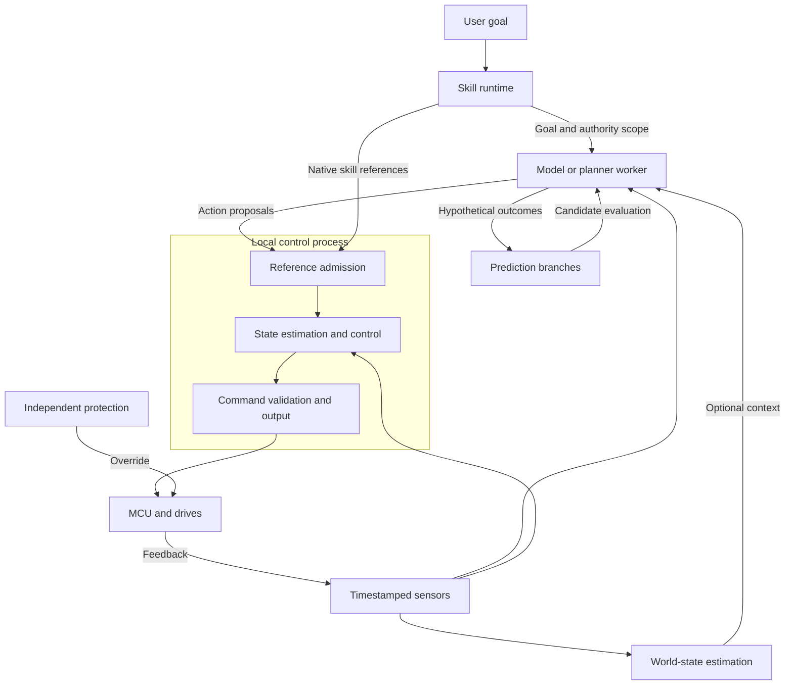
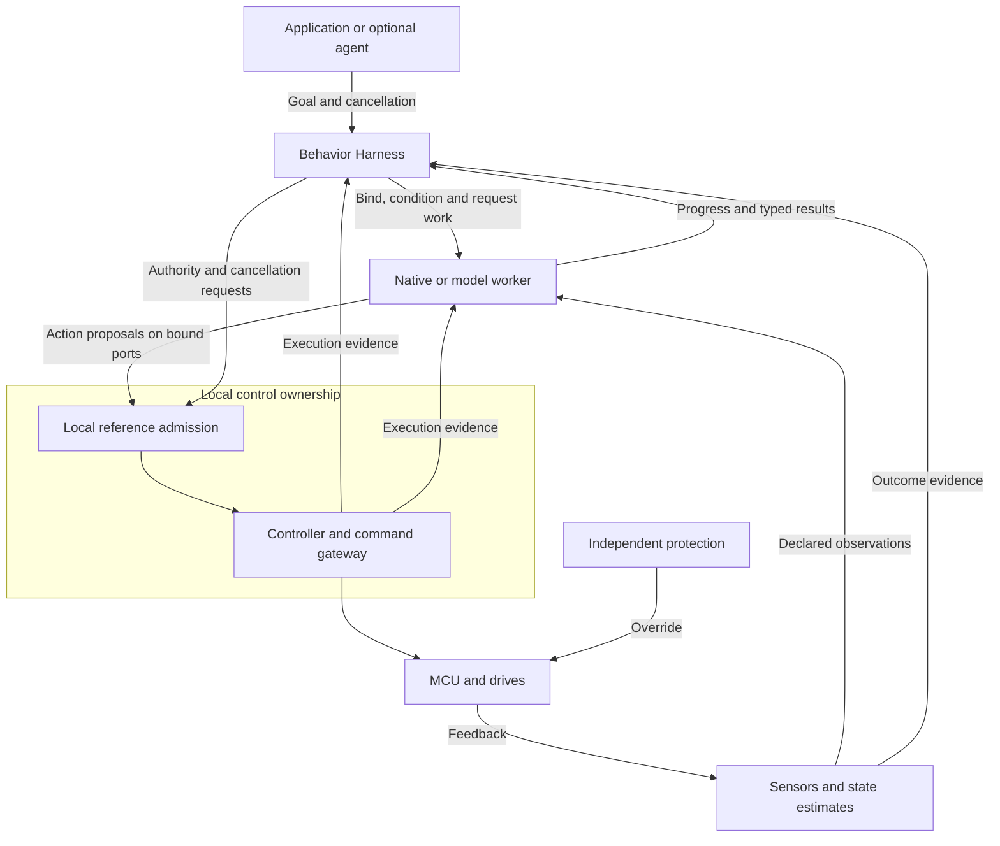

**HefaOS redesign proposal — 4 September 2026; harness and deployment-scope revision 5 September 2026**

**Recommended direction:** build HefaOS around typed dataflow, explicit ownership, hybrid execution, and local control authority. Periodic controllers, data-driven perception, and goal-driven skills share one contract model while using execution mechanisms appropriate to their timing requirements. Make the model boundary support classical algorithms, learned policies, vision-language-action models (VLAs), predictive world models, and fused world-action models without requiring one internal decomposition.

This proposal turns the earlier architecture review into concrete decisions. It applies to the supplied historical v1 and the hybrid scheduling direction agreed in this conversation. It is a proposed successor design, not an assessment or replacement of the repository's unseen canonical v2 documents. The interfaces below are design sketches; no HefaOS implementation or hardware has been validated in this work.

**Choose the deployment scope first.** HefaOS must support a complete classical-only robot without learned inference, model weights, an agent, prompting or training services. The shared runtime contracts address timing, state, ownership and physical execution; extensions are enabled by the selected task and implementation. The classical-only component map and completion criteria are in §30. Preserving learned-model support in this proposal does not make it a prerequisite for the core product.

**Equal architectural support.** Classical, learned and hybrid robots are first-class deployment paths. “Optional” describes selecting a capability; once selected, its declared input, state, timing, resource, lineage and lifecycle requirements are mandatory. A deployment must reject missing required support rather than silently degrade the model interface. Section 30 scopes one deployment profile; it does not reduce the model contracts in §§12, 18–29 or make a classical behavior implementation a prerequisite for a learned robot.

| Reading path | Sections to use | Scope |
|---|---|---|
| Classical-only implementation | §§1–11, 13–18, applicable shared contracts in §§20–21, core conformance in §28, native harness path in §29, and §30 | Read shared requirements; omit model-specific paragraphs and services. The core milestone sequence can finish without ML. |
| Classical planning with prediction or MPC | Classical path plus applicable prediction/objective contracts in §§20–22 | Analytical prediction is supported without a learned world model or model-serving stack. |
| Learned perception or action | Shared runtime contracts plus §12 and the relevant capabilities/gates in §§19–23 and §29 | Integrate learned behavior directly; no prior classical task planner or skill catalogue is required. Learned perception does not require a learned motion policy. |
| Predictive world models and fused world-action models | Shared runtime contracts plus §§12, 18–23 and §29 | Support separate predictors/planners or a fused session with native tensor/latent interfaces; required prediction cannot be omitted from the selected behavior. |
| Demonstration prompting, adaptation or training | Relevant execution path plus §§24–27 | Required when the selected behavior or learning workflow uses it, including demonstration prompting with unchanged learned weights; otherwise omit it. |

This is a scope map, not a claim that whole section ranges are exclusively ML-related. In particular, §18's epistemic distinctions, §20's action/execution semantics and §21's timing rules also apply to classical systems. Even within the core, a map store, camera pipeline, shared-memory transport, network adapter or goal harness is required only when the chosen deployment uses it.

**Model integration revision:** sections 1–17 retain the earlier runtime corrections and incorporate model execution requirements. Sections 18–23 define model roles, a compatibility matrix, session and prediction contracts, action timing, execution patterns, and validation. Named research systems illustrate interface requirements as of 4 September 2026; they are not claims of implemented HefaOS support. Compatibility must be demonstrated for each checkpoint, embodiment, backend, and deployment profile.

**Demonstration and adaptation revision:** make teaching through examples a first-class goal interface. Sections 24–27 add demonstration artifacts, prompt-aware sessions, distinct adaptation modes, learning services, and a staged open-model experiment. This extends the model-agnostic design: language, native skills, direct policies, and predictive models remain useful. HefaOS supplies the lifecycle and data contracts; the selected model must already possess, or be trained to acquire, the relevant prompting capability.

**Abstraction audit revision:** distinguish definitions, runtime instances, jobs, artifacts and evidence. The corrections below tighten action semantics, authority handover, session mutation, capability negotiation, and learning environments. Section 28 provides the canonical boundaries and conformance cases; the companion abstraction review records findings and coverage. These are design corrections, not results from an implemented runtime or physical test.

**Harness definition:** section 29 defines the **HefaOS Behavior Harness** as the subsystem that coordinates a requested behavior with its implementation, context, execution lifecycle and outcome evidence. It assembles the existing skill runtime and model adapters; it relies on the supervisor, executors, data services and local control rather than duplicating their ownership. One generalist model, several specialists, native skills, predictive planners and fused world-action models use the same boundaries. Automatic routing and live model replacement are optional; selected models still require admitted backend availability and lifecycle management. An LLM is not required in the control loop.

**1. Establish a small local control runtime.**

Keep state estimation, bounded controller computation, command validation, and hardware-facing output together initially. Make them separately testable modules inside one trusted control process. This avoids a shared-state service or synchronous cross-process request on every control tick.

Keep general model inference, perception, mission/agent execution, and recording outside this process. A small learned feedback controller may join the local runtime only through its own validated execution profile. The supervisor loads a validated plan and manages lifecycle transitions; it does not dispatch every control iteration. A supervisor failure must have an explicit local continuation or fallback policy.

| Component | Owns | Accepts | Produces |
|---|---|---|---|
| Local control | Current control state, active motion reference, local command authority, actuator handles | Bounded feedback and validated reference proposals | Validated actuator commands; bounded telemetry |
| Perception | Classical processing or learned inference jobs and derived observations | Leased sensor buffers | Timestamped observations with provenance |
| World-state store | Object identity, estimated geometry/belief, observation history, semantic associations | Observations and calibration/transform updates | Versioned query results and relevant change events |
| Skill runtime | Goal lifecycle, skill state, coordination | User goals, capability descriptions, world observations | Motion-reference proposals and progress |
| Model worker | Model bundle, session state, device allocations, inference/rollout jobs | Required sensor history, goals, optional world-state queries, execution feedback | Observations, action proposals, predictions, or a supported combination |
| Prediction branches | Bounded hypothetical outcomes and their assumptions | Analytical or learned rollouts with context and action provenance | Candidate evaluations for planning and diagnostics |
| Supervisor | Deployment configuration and activation | Validated manifests and lifecycle requests | Process startup, configuration and activation decisions |
| Recorder | Durable diagnostic history | Bounded event streams and selected sensor data | Causal traces and replay inputs |
| Teaching and learning services | Demonstration artifacts, datasets, training/evaluation jobs and model provenance | Recorded experience, operator examples, supported model recipes | Prompt packages and evaluated candidate bundles; no direct device authority |
| Independent protection | Hardware-specific override and fault response | Local protection signals and demonstrated control progress | Required stop/hold/disable behavior |

These are logical boundaries. Perception and world-state ownership may share a process initially. A fused model may own its encoder, latent dynamics, planner, and action head in one worker and GPU session. Models may consume raw sensor history directly; the world-state store is an optional contextual input, not a mandatory intermediate representation for every policy. Control and independently enforced protection retain the separation required by the actual failure model.

A learned deployment retains its required native tensors, GPU buffers, temporal histories, recurrent/latent memory and supported streaming or joint outputs. Making these facilities absent from a classical deployment must not replace them with text, object-store rows, per-tick host copies or stateless callbacks in a learned deployment. Integration must measure overhead against the selected model's direct execution baseline (§23); common external contracts do not require identical internal representations.

The component table is a catalogue, not a required process list. For a classical-only deployment, omit learned-model workers and teaching/learning services; instantiate a native planner as a `TaskInstance` where needed. Section 30 identifies which other components are conditional. A native estimator or controller keeps its private state under `TaskInstance` without manufacturing a `ModelSession`.

The Behavior Harness (§29) groups behavior coordination across the skill runtime and model integration boundary. It is a separately defined subsystem within HefaOS, not another process required between every pair of components. Local control owns reference admission and final command eligibility; the harness submits requests and consumes the resulting evidence.



The diagram shows permitted relationships, not a mandatory pipeline. A direct policy need not call a separate planner or predictor. A native skill need not use a learned model. A prediction branch has no actuator authority; only an admitted action can affect local execution.

**2. Replace unrestricted task callbacks with declared task contracts.**

Use this conceptual interface:

```text
TaskSpec
  implementation_id, interface_version
  private_state_schema
  input_ports[]
  output_ports[]
  activation_condition
  execution_requirements
  resource_claims[]
  failure_policy
```

Each task owns its private mutable state and declared outputs. Provide inputs as immutable views with defined lifetimes. Remove unrestricted global store access from the normal task API. Bind exclusive resources, such as an actuator group, during activation.

`TaskSpec` is an immutable definition. A `TaskInstance` is one activated owner of state and resolved bindings. An asynchronous `JobTicket` identifies one request, its input/context revisions, deadline, cancellation state and completion; it never owns actuator authority by itself. A worker hosts instances, and an executor schedules work. A control tick can use preallocated state and a cycle counter rather than allocating a job object. Deployment admission resolves execution requirements into one `ExecutionProfile` and a resource reservation; declarations in model, task and deployment manifests must not create independent competing budgets.

For a model task, `private_state_schema` describes the session lifecycle and externally meaningful state version. It need not serialize every latent tensor or backend cache. A fused computation can be one task with declared external ports and resource bounds; HefaOS must not require each neural layer or internal reasoning step to become a graph node.

Graph validation rejects conflicting writers, incompatible declared types/units, missing input policies, invalid instantaneous cycles, and incompatible device capabilities. It checks declared frame-conversion requirements; availability and validity of dynamic transforms must also be checked at execution. Resource admission separately checks the selected deployment's capacity and timing assumptions. A structurally valid graph is not automatically schedulable.

The supervisor distributes serializable task identifiers, configuration, channel bindings, and plan versions. Each process resolves identifiers to its local implementations. Captured language closures remain local.

A restricted API helps prevent accidental misuse. It is not a security boundary against arbitrary native code loaded into the control process. Treat native control plugins as trusted code; place less-trusted extensions in separate processes with restricted device and memory permissions.

**3. Give every graph edge a temporal contract.**

Support periodic, data-driven, and goal/event-driven activation. Periodic execution uses absolute release times; data-driven execution becomes eligible when its input condition is satisfied. Goal-driven work uses a lifecycle with timeouts and cancellation. None of these trigger choices alone establishes a hard deadline guarantee.

Distinguish cadence from clock domain. A 30 Hz camera and a 1 kHz controller can use a common synchronized time base while producing or consuming data at different rates; these numbers are illustrative, not HefaOS defaults. They still need explicit sample selection, age limits, latency and gap policies. Separate clocks additionally need mappings and uncertainty bounds (§10). ROS 2 similarly separates time sources, clocks, durations and rates. [ROS 2 clock and time design](https://design.ros2.org/articles/clock_and_time.html).

| Input policy | Meaning | Example |
|---|---|---|
| Same cycle | Consume output produced for the current local control iteration | Estimate to controller to command validation |
| Latest eligible | Select the newest admissible sample visible at the defined cycle boundary | External reference or slower observation |
| Ordered interval | Consume the bounded sequence spanning the requested time interval | IMU integration |
| Time-aligned join | Match inputs within a declared synchronization window, with a maximum wait | Stereo or multi-sensor processing |
| Delayed feedback | Consume a prior iteration's state/output, with an explicit initial value | Recurrence or feedback across graph iterations |

Every input also declares age limits, queue/retention bounds, gap handling, and a missing-input policy. Inputs that arrive after the iteration's selection cutoff enter a later iteration even if their source time is earlier. Record selected sample IDs so this choice is inspectable.

Bind these rules in a versioned `PortSpec` containing payload schema, semantic type, access/lifetime, temporal selection and capacity requirements. Assemble correlated inputs as an `ObservationBatch` or another typed input batch: record the selected sample IDs, capture intervals, clock-map versions and maximum skew. Selecting the latest sample independently on each port does not establish cross-sensor consistency. Payload optionality and errors are typed; distinguish unavailable, stale, invalid, incompatible and resource-exhausted inputs. Unknown semantic versions fail binding unless an explicit compatible conversion is registered.

Sample age means time since the underlying observation, interpreted in a known clock domain. Publication time alone must not refresh stale content. Derived data retains relevant input provenance. Different consumers can have different acceptable ages for the same observation.

Use independently scheduled periodic releases or a rational release schedule for non-integer rate relationships. Keep sensor-driven pipelines tied to acquisition events where appropriate. Do not force 30 Hz perception into an integer divisor of a 1 kHz global tick.

Existing runtimes demonstrate the trigger pattern: Holoscan supports time, message-availability, and asynchronous execution conditions. Its documented periodic condition is an eligibility mechanism; HefaOS still needs its own release/deadline contract. [Holoscan conditions](https://docs.nvidia.com/holoscan/sdk-user-guide/components/conditions).

**4. Use separate storage representations with one consistent access model.**

Keep a common typed discovery and inspection surface, while giving different data classes different storage. Developers should not need to choose arbitrary storage formats to write a skill; adapters should expose the appropriate semantic type.

| Type | Recommended first implementation | Ownership |
|---|---|---|
| `ControlStateFrame` | Fixed-capacity native struct, populated for one logical cycle | Local control owns mutation; downstream modules borrow a const view within that cycle |
| Sensor history | Fixed-capacity ordered buffers | Acquisition owns publication; estimator consumes declared intervals |
| Images, point clouds, tensors | Pooled immutable payloads | Explicit leases shared only with declared consumers |
| World entities | ECS/SoA where batch queries benefit | An owning service applies updates and publishes snapshots/events |
| Transform history | Bounded time-indexed transforms and calibration identity | Explicit authority for each transform edge |
| Model-session memory | Backend-owned recurrent state, latent tensors and caches, with bounded handles | One session owner; explicit reset, fork and device-completion rules |
| Prediction branches | Immutable hypothetical results in a bounded branch pool | Originating worker/planner; separate from observed world-state updates |
| Telemetry/archive | Batched Arrow/Parquet or another suitable recording format | Recorder owns persistence outside control |

For the first controller, passing a const frame between sequential modules removes the need for general-purpose cross-process MVCC on the hot path. A coherent frame is a logically consistent estimator result; it does not imply every physical sensor sampled simultaneously. Preserve the individual source times and fusion assumptions.

Send diagnostic snapshots through a bounded channel. A small, bounded copy is acceptable when it simplifies ownership and has been included in the timing budget. Optimize copies of large payloads first. Do not expose a raw pointer into the live control frame to external readers.

Use a shared `SampleEnvelope` for identity, schema, source/capture time, provenance, quality and payload handle; add frame/calibration fields only where meaningful. Declare its role as measurement, estimate, feature, demonstration or counterfactual. Private session state is a separate mutable ownership domain. An old demonstration can satisfy a prompt port but cannot satisfy a live measurement port merely because their tensors share a shape. The control frame remains a native representation of the selected estimate, not a mandatory container for every model tensor.

Arrow remains useful for columnar exchange and analysis, but its immutable array API does not supply a mutable robot-state synchronization mechanism. [Arrow arrays](https://arrow.apache.org/docs/cpp/arrays.html).

**5. Make buffer ownership explicit and bounded.**

Use a lifecycle such as:

```text
loan mutable buffer
fill payload
publish and surrender write access
consumers acquire immutable leases
consumers and asynchronous device work complete
reclaim buffer for reuse
```

The actual interprocess layout must use validated region/offset handles or backend-native transferable handles. Raw pointers and standard spans exist only as local views after acquisition. Descriptors carry length, capacity, generation, memory domain, device identity where needed, format/strides, and relevant synchronization objects.

Implement explicit maximum outstanding leases, queue capacities, and per-component budgets. Size pools for retained history, queued samples, concurrent consumers, active inference, and producer loans. Separate control resources from bulk perception and recording resources.

A reader timeout does not prove that its memory is no longer being read. Stop granting new leases, isolate or stop the consumer according to policy, and reclaim only after the transport/backend confirms ownership has ended. GPU work may outlive a host callback. Retire a buffer only after the associated completion event or fence permits it; quarantine uncertain ownership rather than reusing the bytes unsafely.

At a backend boundary, negotiate payload layout, dtype, device, readiness, mutability and release behavior together. A borrowed immutable tensor must not acquire a writable alias through an inference adapter. Copy into owned scratch when required, and include that copy in the budget. DLPack offers tensor layout/lifetime and stream-interchange mechanisms; its presence alone does not establish HefaOS immutability or cross-process authority. [DLPack Python interchange specification](https://dmlc.github.io/dlpack/latest/python_spec.html).

Reuse a maintained transport implementation where it fits. For example, iceoryx2 documents configurable limits on publisher loans and subscriber retention; verify the pinned implementation's crash and resource behavior before integrating it. [iceoryx2 configuration](https://github.com/eclipse-iceoryx/iceoryx2/blob/main/config/README.md). Linux also provides explicit buffer synchronization mechanisms. [Sync-file API](https://docs.kernel.org/driver-api/sync_file.html).

**6. Split predictable execution from flexible execution.**

| Executor | Recommended behavior |
|---|---|
| Local control executor | Static placement, absolute periodic releases, bounded work, preallocated storage, explicit input cutoff and output deadline |
| Perception executor | Bounded asynchronous jobs; readiness and completion events; input age and output expiry checks |
| Model/planning executor | Budgeted policy inference and optional candidate rollouts; session sequencing; bounded device memory and queues |
| Mission executor | Goal and event handling, asynchronous waits, cancellation, bounded retries |
| Management/recording workers | Best effort, bounded communication with control, no synchronous disk work on a control tick |

Limit work stealing to flexible workers. Keep controller execution frequency fixed within an admitted operating mode. Revalidate the controller and transition behavior before supporting another frequency. A generic overload handler must not simply slow a controller or replay its last torque.

Before activating a deployment profile, check requested scheduling/affinity/memory settings and all returned errors. Prefault and warm the required resources, reserve stack/storage, account for driver and communication costs, and test under shared-memory, GPU, interrupt, and thermal load. Classify actual timing support per deployment; a profile label cannot create a guarantee.

Keep the initial protection path independent of best-effort GPU inference. CUDA priorities do not guarantee preemption of already-running work. [CUDA stream API](https://docs.nvidia.com/cuda/cuda-runtime-api/group__CUDART__STREAM.html). A learned controller can be supported later through a separately validated execution profile with compatible inputs, resource bounds, and fallback.

Handle lateness explicitly: skip eligible-but-obsolete work before launch, reject obsolete completed output, and retain resources until running work actually completes or is safely terminated. A cancelled future is not proof that computation or DMA stopped.

**7. Bind motion authority to a local gateway.**

Make two acceptance stages explicit. Admission of a trajectory/reference checks its goal, ownership, representation, and required planning constraints. The per-cycle gateway checks the candidate command against current local limits and validity. Expensive scene planning should not be inserted as an unbounded call into this gateway.

Use distinct semantic stages: `ActionProposal` is an unadmitted action/sequence from a policy or planner; `MotionReference` is an admitted input to a selected controller; `CommandCandidate` is that controller's output for a control cycle; `DeviceCommand` is the validated hardware-facing encoding. These need not imply four memory copies. A learned feedback controller may occupy the controller stage directly under an admitted `ControlModeSpec`; it need not manufacture an asynchronous motion plan for each tick. The gateway still validates its candidate.

`ControlModeSpec` binds the controller implementation, canonical actuator set, supported reference and command schemas, feedback requirements, period, interpolation/holding rules, limits, expiry response and mode-transition procedure. An `ActionSpec` describes what a producer's numbers mean; it does not choose the active hardware mode or override controller behavior. Admission validates their compatibility, including supported impedance/force combinations and coordinated channels. Mode changes invalidate incompatible references and reconcile controller state before activation.

| Motion-reference field | Purpose |
|---|---|
| Robot and actuator group | Identifies the physical scope |
| Boot/session and authority generation | Prevents an old process or former owner from controlling the current session |
| Goal ID and goal generation | Rejects output from cancelled or superseded work |
| Context generation and behavior identity | Binds an action to the admitted prompt set and adaptation configuration, not just the base model weights |
| Sequence | Handles duplicates and out-of-order delivery |
| Start time, horizon, expiry, clock mapping | Defines when the reference may be applied |
| Robot/model/calibration compatibility | Prevents use with the wrong embodiment or interpretation |
| Relevant observation provenance | Supports freshness and context checks for the action |
| Reference payload and operating limits | Defines the intended motion within the admitted envelope |

Use fixed-size IDs in the control path; resolve richer metadata during admission. Do not require equality with one global world-state version on every tick: unrelated world updates would continuously invalidate useful motion. Validate the relevant dependencies, compatible epochs, validity windows, and current local constraints instead.

An action adapter decodes a producer's `ActionSpec` into the reference type supported by the selected controller. The producer can be a native planner or a learned policy; an already compatible native reference needs no redundant decoding stage. Joint targets, Cartesian deltas, velocities, torques, and gripper events need distinct semantics. A policy can bypass an unnecessary classical planner while still passing through applicable reference admission and local command checks. Record any rejection or modification and return execution evidence to the owning task or model session; an altered action can invalidate an analytical or learned prediction (§§20–21).

The action adapter must also specify each delta's anchor, orientation composition convention, policy interval, channel synchronization and any allowed retiming. A Cartesian delta relative to the observation-time tool pose is different from a delta relative to the application-time pose. Trace the resulting admitted reference when decoding, kinematics, saturation or interpolation changes the candidate. Numeric endpoint limits alone do not bound every interpolated intermediate command. Controller interpolation depends on the supplied trajectory fields and configuration, as illustrated by ROS 2 control's trajectory documentation. [Trajectory representation](https://control.ros.org/rolling/doc/ros2_controllers/joint_trajectory_controller/doc/trajectory.html).

Within each tick, associate validation with the exact candidate and control-state cycle, then send only that accepted candidate. Rejection selects the declared local fallback. The gateway should be a bounded module in the control process initially, not a remote approval service.

Document exactly which hazards the gateway checks. Passing numerical limits and freshness checks does not establish that a grasp is appropriate or a trajectory is collision-free. Planning checks, current monitoring, and independent protection each need their own stated coverage and assumptions.

Restrict device handles and writable command regions to the control runtime. Authority tokens and typed APIs prevent mistakes only within their stated trust boundary. All hardware-driving pathways, including manual control and recovery, must participate in explicit ownership and handover.

Represent proposal authority with an `AuthorityLease`: owner/invocation, robot session, canonical actuator IDs, allowed mode, generation and expiry. Resolve group aliases before conflict checks, including coupled interfaces on the same physical actuator. The lease permits reference submission within scope; device handles remain owned by local control. Coordinated bimanual actions acquire their complete resource set through one admission decision, or wait without holding a conflicting subset.

Revocation blocks newly eligible commands locally; it cannot erase bytes already sent or motion already queued on a device. Track submitted/applied sequence ranges, device queue coverage and supported flush/stop acknowledgments. Complete handover only after the old output is fenced at the device or reaches a demonstrated quiescent state under the robot profile. If the hardware cannot bound residual execution, declare the limitation and restrict operating modes accordingly; a new host generation alone is insufficient. ROS 2 control's resource-claim pattern is a useful precedent, while the physical fencing rules remain HefaOS deployment responsibilities. [Controller interface ownership](https://docs.universal-robots.com/Universal_Robots_ROS2_Documentation/doc/ur_robot_driver/ur_robot_driver/doc/usage/controllers.html).

**8. Define protection and fallback per robot operating mode.**

Create a protection profile identifying fault detection, watchdog coverage, response timing endpoints, stopping/holding behavior, and reset rules. Record the mechanism-specific assumptions: load, gravity, brakes, drive behavior, feedback availability, and relevant constraints.

| Fault | Required decision in the profile |
|---|---|
| Perception becomes too old | Whether current motion may continue within a bounded envelope, transition to another controller, or stop |
| Reference expires | Which local fallback takes over and its permitted duration |
| Control progress stops | How the MCU/drive detects loss of progress and reaches its defined response |
| Feedback becomes invalid | Which behavior remains possible without that feedback |
| Communication fails | What local control and protection can still execute |
| Electrical power disappears | What happens mechanically without active computation or torque |
| Fault clears | What must be checked before granting motion authority again |

Progress monitoring must depend on completed valid control activity, not a heartbeat thread that can remain alive while the controller is stuck. A fresh heartbeat alone must not clear a latched stop. A separate physical/protection path remains able to override software output.

A position hold, controlled deceleration, torque disable, or brake engagement can each be appropriate in some configurations. Do not define one as universally safe. The robot profile must choose and validate it. Microsecond signal propagation must not be presented as measured mechanical stopping time.

**9. Put the fast loop where the hardware can support it.**

The earlier seven-joint packet calculation remains a useful design constraint: 17-byte commands and 18-byte feedback packets at 1 Mbps with 8N1 framing require 1.19 ms and 1.26 ms respectively for all seven joints, before software/transport overhead. Adding richer protocol fields changes these figures and requires recalculation.

For the initial design, close fast actuator loops inside the MCU/drive where the device supports them. Let the host provide bounded references at a rate justified by the actual link and controller. A position-only smart servo must not be advertised as a torque controller merely because the HAL has a torque method.

Use a `DeviceProfile` describing supported control modes, units, ranges, feedback quality/timestamps, batching/synchronization, transport limits, and failure responses. Binding a skill/controller to incompatible capabilities should fail before activation.

Include canonical actuator topology, coupled command-interface constraints, command queue limits, command lifetime, cancellation/flush behavior and which acknowledgment establishes receipt versus application. Declare persistent setpoint semantics explicitly. These facts constrain the authority handover and `ControlModeSpec`; the host cannot supply guarantees that the device lacks.

Make wire encoding explicit: byte order, framing, length/version, sequence, session identity, command validity, checksum, and acknowledgments. Distinguish accepted, applied, and physically completed. Retries must not blindly repeat a non-idempotent action. Checksums and session IDs do not replace authentication where the transport is outside the trusted local boundary.

For synchronized joints, specify whether a batch is applied atomically or at a scheduled time. USB/serial write completion alone must not be treated as simultaneous physical actuation. Driver APIs must either provide a bounded call or move acquisition into a worker that publishes timestamped results.

**10. Give observations a common geometric and temporal envelope.**

Every observation should identify its source, source boot/session, sequence, source clock and sample time, receive time, frame, calibration, validity, and uncertainty where meaningful. Derived outputs carry links to relevant inputs rather than silently acquiring a new observation time.

Use local monotonic time for scheduling and expiry. Keep wall-clock time for human reporting. Map external sensor, MCU, and remote-host times into the local time domain with a known uncertainty bound. If the uncertainty makes freshness undecidable, apply the configured invalid-input policy. Starting a new receive-time TTL cannot by itself establish that a delayed remote observation is fresh.

Treat simulation time as a distinct supported domain. Pausing or rewinding simulation must not create authority over live devices. Record clock resets and mapping changes as explicit events.

For world entities, separate persistent identity, semantic labels/embeddings, geometric estimates, observation history, and validity. A semantic query can nominate a target; execution still needs sufficient current geometry and the action's preconditions. Use relevant-change events for replanning instead of waking the whole mission on every world-state write. Label measured observations, estimator beliefs, and counterfactual predictions distinctly; estimates remain uncertain, and a plausible imagined object pose is not a new measurement.

**11. Make skills the interface between agents and motion.**

The skill runtime is the goal-lifecycle coordinator within the Behavior Harness (§29). A skill definition and a model artifact are not in one-to-one correspondence: several skills can bind the same model, and one skill can coordinate several compatible implementations. Continuously supervised control modes can operate without a goal-oriented harness invocation.

Start with a small native skill catalogue, such as observe, move to a named pose, follow a trajectory, grasp, release, and stop according to the robot profile. A skill declares typed parameters, required capabilities, exclusive resources, preconditions, progress, success evidence, timeout, cancellation behavior, and recovery.

Separate immutable `SkillSpec` from each invocation. Its `GoalSpec` accepts typed parameters and optional language, goal observations or prompt references; it declares how contradictory inputs are resolved or rejected. Its `OutcomeSpec` identifies the completion monitor, required evidence, freshness, and unknown-result handling. Planning cost, learned reward, goal satisfaction and protection constraints have different roles. A new demonstration may specify behavior without supplying an automatic success detector; use an explicit operator-observed outcome or leave completion unverified until suitable evidence exists.

Skills govern goal-oriented activity. A continuously operating estimator or balance controller can instead belong to a supervised operating mode, with health and stop conditions, without requiring an LLM, demonstration or fabricated task-completion event. Goal/context fields are applicable to the behavior being governed, not compulsory semantic dependencies for every sensor/control component.

An LLM proposes a skill invocation. Normal code validates its structure and capability access. The skill runtime manages execution and produces motion references through the local admission path. For an initial system, an agent should have no arbitrary code-execution or direct actuator API inside the control process.

A skill is a goal, resource, cancellation, and outcome contract; its implementation can be a native controller, a VLA, a recurrent RL policy, a predictive planner, or a fused world-action model. A learned skill can execute a whole manipulation behavior without being decomposed into hand-written microactions. An LLM is optional. Keep the policy's required observations available and validate success from appropriate physical evidence, rather than treating its own generated success text as completion.

A skill can also be specified by a recorded demonstration with a compatible prompting model (§24). Saving such a skill stores its prompt references, model requirements and execution contract; it does not imply a new set of trained weights. Distinguish an operator's task example from evidence that the current robot has completed that task.

Use explicit execution states with an orthogonal physical-outcome view:

| State | Meaning |
|---|---|
| Pending | Received and structurally valid, but not yet admitted |
| Active | Admitted resources and execution are current |
| Cancelling | New work is inhibited; the mechanism is reaching the defined cancellation outcome |
| Succeeded | Required completion evidence has been observed |
| Failed | Known failure with a defined robot response |
| Cancelled | Cancellation outcome is established; authority has been reconciled |
| Uncertain (derived display) | The physical-outcome view is unresolved, regardless of whether software has failed, finished or been cancelled |

Track software execution status separately from physical outcome. A failed job may leave the effect unknown; record `Failed` with unresolved physical evidence and require reconciliation. The visible `Uncertain` condition summarizes that unresolved outcome rather than overwriting whether the software succeeded, failed or was cancelled. Outcome evidence can arrive later without rewriting the original execution event.

Receiving a cancellation request is not the same as completing cancellation. Revoke obsolete references, select the defined local response, and report completion only with the required evidence. A timeout also does not prove that a physical action did not occur.

For the first release, avoid complex concurrent multi-resource missions. If several skills can run together, declare disjoint resources or provide an explicit coordinated admission/handover protocol. Do not rely on an agent to avoid conflicting commands.

**12. Package models with their behavioral contract.**

This section's model-serving requirements apply when a deployment uses a model bundle. Native implementations use versioned code, parameters and task/control contracts in `DeploymentProfile`; they need no weights, model registry or inference session. The deployment profile permits zero model-bundle bindings. All implementations retain applicable compatibility, resource, activation and recovery checks.

Separate model selection, residency, session creation and motion permission (§29). The harness selects an eligible implementation or uses a static binding and requests preparation. The supervisor admits deployment resources and activation; the worker owns loading, backend allocations and private model state. A ready or resident model has no motion permission merely because it finished loading.

A `ModelBundle` is an immutable artifact manifest: model/code hashes, supported backend/interface versions, preprocessing and normalization, output interpretation, embodiment/action mapping, observation and context requirements, supported adaptation, and resource requirements. Include `ObservationSpec`, `ActionSpec` where applicable, session/reset rules and optional prediction schema. The `DeploymentProfile` separately binds this bundle to a backend, device, control mode and fallback; evaluation evidence references that exact combination (§§20, 28). Pin tokenizer, camera order, image transforms, history cadence, decoder and statistics with the weights. Tensor shape matching is only one compatibility check.

Stamp inference jobs with the goal/session and model generation they belong to. On completion, reject outputs from cancelled goals, superseded models, or incompatible calibration/robot contexts. Rejecting the result does not end the memory lifetime of still-running device work.

Choose a simple first activation rule: change control models, controller configuration, and control-graph topology only at a defined inactive or safe checkpoint. Validate and warm the replacement, check memory/resources, reconcile controller state, then explicitly activate it. If both model versions cannot fit in memory, do not promise an uninterrupted swap.

This rule covers deployed bundle replacement and persistent learned-parameter changes. A model whose defined inference algorithm updates private fast weights may use those as session state only through an explicitly admitted adaptation profile (§25). The base bundle remains identified separately; permitted state updates, their resource bounds and reset behavior are validated together with the inference algorithm. General online fine-tuning does not become permissible merely by calling it session memory.

Perception can later support rolling model replacement: prepare the new bundle off the control path, stop assigning new work to the old generation, switch at a defined boundary, and retire old jobs after completion. Recurrent state and action chunks need explicit reset/migration and continuity policies.

For action-chunk policies, references carry start time and horizon. A new chunk is accepted only under the declared replacement and continuity rule; the robot has a local fallback if the next chunk does not arrive. Check transitions as well as individual values. Section 21 distinguishes inference cadence, action cadence, and controller cadence, and defines how an adapter handles inference delay and the already committed action prefix.

Support native research backends, optimized local backends, and remote endpoints through capability-specific adapters. ONNX export is an optional deployment choice. A model with custom operations or an internal iterative planner should not require an OS redesign. Backend flexibility does not waive resource admission, version identity, or deadline checks; remote inference never acquires local actuator authority.

**13. Bound overload at the input where it occurs.**

| Path | Initial policy to evaluate |
|---|---|
| Camera to live detector | One active inference plus a bounded newest pending input; record superseded drops |
| Temporal model to session | Preserve the declared history/order; explicitly handle missing frames, session lag, and resets |
| Demonstration to model context | Bound prompt length, preprocessing/prefill work, cache memory and replacement latency; never silently evict task-defining context |
| Predictor to candidate planner | Bound candidate count, horizon, device memory, queue size, and decision deadline; discard obsolete branches |
| IMU to estimator | Bounded ordered history; detect gaps and apply estimator policy |
| Planner to control | Bounded reference proposals; reject expired, incompatible, duplicate, or superseded proposals |
| Agent goals | Explicit admission queue; cancellation and admission outcomes are visible |
| Control to recorder | Preallocated nonblocking event channel; count losses and preserve the defined fault indicators |
| Bulk sensor recording | Separate retention/copy budget; recording cannot retain control resources indefinitely |

The newest-pending policy is appropriate only when the algorithm tolerates skipping inputs. Do not apply a single-frame detector's dropping policy blindly to a recurrent policy or video world model. The initial controller must not wait for downstream logging capacity or predictive rollouts. Where a use case requires lossless audit before further movement, define a controlled transition triggered by recorder health instead of blocking midway through a control tick.

The first prototype should have one authoritative configuration for all pool sizes and queue depths. Derive total memory usage, including backend allocations and model replacement peaks, from that configuration. Reject a deployment when the configured storage cannot hold its declared formats and retention limits.

**14. Make lifecycle and restart behavior explicit.**

Separate component readiness from motion permission. A process can be configured and healthy while actuator output remains disarmed. Device reconnect, process restart, and restored network connectivity should return to a state that requires compatible configuration, valid state, and current authority before motion resumes.

Managed lifecycle states already provide a useful precedent in ROS 2. HefaOS should add its robot-specific authority and physical-recovery rules to an equally explicit lifecycle. [ROS 2 lifecycle example](https://docs.ros.org/en/humble/p/lifecycle/).

For each failure domain, specify the outcome:

| Failure | Expected architectural response |
|---|---|
| Mission process | Existing admitted motion continues only under its bounded policy or transitions locally to fallback; no fresh goals are fabricated |
| Perception process | Observation freshness expires normally; affected actions take their defined response |
| Model/prediction worker | Local reference coverage or fallback governs motion; obsolete sessions and branches lose eligibility; outstanding device work retains its memory until completion is established |
| Recorder | Control remains schedulable; audit loss/health is observable and the selected operating policy applies |
| Supervisor | Loaded local execution plan remains usable for its permitted operating window; no arbitrary reconfiguration |
| Control process | Independent MCU/drive protection detects loss of valid progress |
| Shared-memory transport | Local control and protection have defined behavior without new external data; no dependency on rebuilding the shared store to stop |

A restart receives a new session/authority generation. Flush or reject queued old commands. Restore software state only after reconciling what the robot physically did. For a grasp with uncertain outcome, inspect gripper feedback and the object before deciding whether to repeat it.

A model's latent memory also needs reconciliation. Reset and recondition on current observations when its action history is incomplete or its checkpoint is incompatible. Do not restore a cached latent trajectory and assume the real robot followed it during a crash. Session migration is supported only when the adapter defines and validates it.

**15. Use local authority across network and ROS 2 boundaries.**

Keep per-robot state ownership. Exchange observations, goals, and bounded proposals over a versioned network protocol; do not pretend remote machines share one mutable ECS store. Define authentication, time mapping, duplicate detection, partition behavior, and bandwidth limits for each supported deployment.

A remote planner may produce a reference proposal, but the robot admits it locally. An old network response does not become current merely because it arrives after reconnection. Use the robot session, goal generation, compatible context, and time validity to decide.

Build ROS 2 adapters for the interfaces the first robot needs. Preserve units, timestamps, coordinate frames, QoS intent, errors, lifecycle, and action cancellation/results. Generic message conversion is insufficient for motion authority. Permit ROS 2 controllers and drivers to remain permanent components where they serve the product well.

Distinguish local shared-memory transport from network transport behind the same semantic ports. A network transfer may copy or serialize; preserve the contract rather than claiming universal zero-copy behavior.

**16. Record why an action happened.**

Give each accepted physical action a trace linking the goal and skill, selected observations, transformations/calibration, model bundle, admitted reference, control cycle, candidate command, acceptance/rejection reason, and available application/completion feedback. Use compact fixed-size events on the control path and resolve metadata asynchronously.

For model-based execution, also link the session revision, observation window, action chunk and committed prefix, prediction-branch IDs, assumed actions, selection objective, available scores, and actual execution evidence. Log full predicted video only under a separate budget; compact provenance must remain useful when bulk artifacts are dropped. Model confidence and prediction error need their metric definitions and calibration context to be interpretable.

For prompted/adaptive execution, record demonstration and prompt-set IDs, context generation, selection/ordering, encoder version, adaptation mode, and relevant fast-state lineage. Record the full episode inputs needed for reproducible dataset construction under a separate capture policy; a diagnostic trace alone is not necessarily a complete training example.

Expose inspection questions such as:

- Which observation was used for this grasp, and how old was it?
- Which task missed its deadline, and which fallback took over?
- Why was this reference rejected?
- Which process held the buffers that exhausted this pool?
- Did cancellation stop new commands, and when was its physical outcome established?
- Which predicted outcome justified this action, and did the applied action differ from the assumption?
- Did a stale session, missing history, or an exhausted rollout budget cause the model to fail?

Implement two replay modes: inspect captured decisions, or rerun selected algorithms on captured inputs. Pin the graph, configuration, model, and calibration versions. Record relevant clock/ordering choices and external responses. State which results may remain nondeterministic.

Run replay against a simulation or recorded-device backend that cannot acquire live actuation authority by default. A replay timestamp or a recovered log entry is not authorization to repeat the associated physical action.

**17. Choose a restrained implementation stack and reproducible deployment.**

For a greenfield implementation, my preference is Rust for the supervisor, contracts, ownership wrappers, and asynchronous runtime, with Python for skills/experimentation and narrow C/C++ adapters to existing robotics and inference libraries. Use native bounded code for control; reuse a suitable C++ controller rather than rewriting its mathematics for language consistency. If implementation is already predominantly C++, apply the same architectural contracts without making a language rewrite a prerequisite.

Safe-language guarantees do not extend automatically through arbitrary native dependencies or FFI. Keep those boundaries narrow and tested; do not repeat the v1 compile-time-memory-safety claim for the whole system. The Rust documentation explicitly discusses responsibility at unsafe and foreign-language boundaries. [Rust FFI](https://doc.rust-lang.org/nomicon/ffi.html).

Pin an exact supported board, OS/kernel, firmware, toolchain, accelerator stack, schema version, and model configuration. Make administrative setup a separate provisioned operation. Normal execution verifies required permissions/settings and fails activation clearly when they are missing. Avoid a world-writable control-memory setup or silent failure of real-time configuration calls.

Generate layout/queue documentation from one manifest. Compile the public examples and schemas in CI. Correct the review's FlatBuffers array placement, invalid standard-C++ stack example, macro substitution, Python module naming, MuJoCo API, and missing native dependency setup. Keep example methods synchronized with real public APIs.

**18. Separate world state, predictive models, and action authority.**

Use these terms consistently throughout the implementation and public API:

| Concept | Question it answers | Representation and authority |
|---|---|---|
| Observation | What did a sensor measure? | Immutable measurement with source time, frame and provenance; interpretation may be uncertain |
| World-state estimate or belief | What does the robot currently estimate to be true? | Object/map/state estimates, history and uncertainty; maintained by an identified estimator |
| Predictive world model | What might happen under these conditions and actions? | A learned, analytical, or hybrid transition mechanism; produces hypothetical outcomes |
| Policy | What action should be attempted? | Maps its required context and goal to one or more action proposals |
| Fused world-action model | What action and associated future does one model propose? | A combined model/session that can emit actions and predictions together |
| Local execution authority | Which action may the robot apply now? | Robot-local ownership, validity checks, controller state and protection rules |

An estimator may propagate a dynamics-based prior between measurements. Label that result as an estimate with its assumptions and uncertainty. A planner's counterfactual branch must not silently replace the current belief or be inserted as a measured observation. Promote information through a defined estimator update, preserving whether it came from a measurement or a prior.

The world-state store is useful for persistent identity, maps, semantic retrieval, coordination, and inspection. A model may instead maintain a private latent belief directly from images and feedback. HefaOS should expose useful summaries when available without requiring the model to decode all internal knowledge into object entities, text, or video.

These boundaries are semantic contracts. They do not require a separate neural network, process, or serialized intermediate for each role. A fused model can share its encoder, dynamics, action head, memory and GPU allocations. External consumers still need to distinguish its observation-derived estimates, predictions, and proposed actions.

**19. Support model families through capabilities and adapters.**

The matrix covers the principal approaches relevant to this proposal, including non-neural baselines. The categories overlap: a VLA may use diffusion, a recurrent policy may be trained with RL, and a world model may be used during training but not for online planning. Declare actual capabilities and operating roles rather than assigning each bundle one exclusive model label.

The integration column specifies proposed HefaOS behavior. Research references establish representative approaches, not verified compatibility with this runtime or the user's robot.

| Approach | Typical interface | How HefaOS would use it | Main integration requirement |
|---|---|---|---|
| Classical control and planning: PID, analytical dynamics, geometric planning, MPC | State/goal to control output or trajectory | Native control task or planner worker; uses the same reference and authority contracts | Admit its control period and computation budget; planning constraints and controller limits remain explicit |
| Perception and representation models: detection, segmentation, pose, visual/video encoders | Sensor input to detections, geometry or features | Data-driven worker publishes observations or model-owned feature handles | Preserve preprocessing, timestamps, frame/calibration and latent-space identity; an encoder alone is not an actuator policy |
| Spatial reconstruction and persistent maps: SLAM, NeRF, Gaussian splats | Sensor history to poses, map or renderable representation | Mapping worker and world-state queries; optional rendered or latent input to another model | Map confidence, calibration and dynamic-object freshness matter; a spatial representation alone does not define action-conditioned dynamics |
| LLM/VLM reasoning and tool use | Language/images/context to a plan, answer or skill request | Mission worker proposes typed goals or skill calls | Validate tool arguments and ownership; generated reasoning or code has no direct control authority |
| Reactive behavior-cloning policies | Current observation, possibly short history, to an action | Model worker proposes actions; a small feedback policy may qualify for a local execution profile | Match observation normalization, action semantics and trained cadence; define missing-input behavior |
| Transformer action-chunk imitation, such as ACT | Images/proprioception to a sequence of actions | Learned skill with a chunk adapter and bounded execution prefix | Preserve chunk timing and the checkpoint's replacement/aggregation behavior; do not assume arbitrary resampling is equivalent. [ACT](https://tonyzhaozh.github.io/aloha/) |
| Diffusion or flow visuomotor policies, with language optional | Observation context to a sampled continuous action sequence | Asynchronous model worker; iterative generation has a budget and completion deadline | Record sampling configuration; only execute a valid decoded output; handover follows the adapter's validated method. [Diffusion Policy](https://diffusion-policy.cs.columbia.edu/) |
| Autoregressive or token-based VLAs, such as OpenVLA | Images and instruction to encoded actions | VLA adapter decodes, denormalizes and maps actions into the robot's supported reference type | Pin tokenizer/action decoding and embodiment statistics; reject malformed or incomplete outputs. [OpenVLA](https://openvla.github.io/) |
| Continuous-action VLAs using diffusion/flow, including the pi family | Visual/language/robot context to action chunks | Learned skill with asynchronous inference and model-aware chunk handover | Support delay compensation or overlap conditioning only where the model supports it. [Physical Intelligence real-time chunking](https://www.pi.website/research/real_time_chunking) |
| Demonstration-conditioned policies: in-context imitation and behavior prompting | One or more demonstrations plus current observations/history to actions | A prompted skill loads a versioned prompt set into a compatible session; fresh execution remains closed-loop | Explicit prompt modalities, episode boundaries, context budget and embodiment compatibility; this capability is not implied by being a VLA (§§24–27) |
| Policies with test-time fast-state adaptation | Observation/prompt history updates model-defined recurrent state, potentially through gradients | An admitted session owns temporary adaptive state and its update/reset rules | Separate mutable fast-state identity from the fixed base bundle and persistent model promotion (§25) |
| Model-free RL policies: feed-forward or recurrent | Robot observations and optional command to action | Periodic policy task in an admitted profile, often with local low-level control beneath it | Match training/deployment observations, action scaling, cadence, recurrent reset and control mode. [RSL-RL](https://github.com/leggedrobotics/rsl_rl) |
| Model-based RL with imagination-trained actors, such as Dreamer | Experience trains a world model and actor; deployment uses observation-conditioned state and policy | Training runs outside live control; deploy the required encoder/state update and actor as a session | Do not require a candidate-search planner merely because training used imagined rollouts. [DreamerV3](https://github.com/danijar/dreamerv3) |
| Latent action-conditioned world models, such as V-JEPA 2-AC | Observation context plus candidate actions to future latent features | Bounded prediction branches support an external or integrated planner | Preserve action conditioning, latent version and goal/cost interpretation; the base visual encoder and action-conditioned predictor have different roles. [V-JEPA 2](https://github.com/facebookresearch/vjepa2) |
| Generative video or interactive world models | Context plus supported conditioning to future images/video or virtual interaction | Offline data/evaluation initially; online foresight only when action semantics, accuracy and latency fit the task | Text/camera/virtual-action control must not be mistaken for calibrated robot-joint control. Verify each checkpoint's conditioning interface. [Cosmos development workflows](https://developer.nvidia.com/blog/advancing-physical-ai-with-nvidia-cosmos-world-foundation-model-platform/), [Genie](https://deepmind.google/models/genie/) |
| Learned dynamics, residual dynamics, and physics/learned hybrids | State and actions to next states, costs or optional gradients | A planner/MPC adapter owns its optimizer and bounded rollout computation | Validate contact, actuator delay and uncertainty assumptions; expose gradients only if supported, without forcing optimizer internals into the OS graph |
| Fused world-action models, such as Cosmos 3 Policy DROID | Context/goal to associated actions and predicted futures | One worker/session emits an action proposal and linked prediction branch; no mandatory separate planner | Keep joint-generation consistency and shared memory; admission may still reject the action. [NVIDIA world-action models](https://developer.nvidia.com/blog/beyond-vlas-how-world-action-models-reshape-robot-manipulation/) |
| Hierarchical, hybrid, ensemble or mixture approaches | High-level goals route to skills/experts; optional candidate scores | Compose skill contracts or keep routing inside one bundle; one authority owner per actuator group | Make handovers and shared-state ownership explicit; do not average incompatible action spaces or grant each expert independent device access |

Five independent axes belong in the bundle/profile: **representation** (symbols, geometry, pixels, latents), **behavior** (encode, act, predict, score, or combinations), **temporal structure** (stateless, history-window, recurrent, chunked), **adaptation** (fixed parameters with context, admitted fast-state updates, persistent fine-tuning), and **operating role** (live feedback, asynchronous planning, training, simulation/evaluation). Local versus remote execution is a deployment choice with its own timing and failure contract.

For an unfamiliar future model, first identify these axes and the capabilities it exposes. If it can honor existing contracts, write an adapter. If it requires a new semantic capability, version and extend that interface. This approach reduces dependence on current model architectures; it cannot promise compatibility with unknown interfaces, unavailable weights, inadequate hardware, or unvalidated robot behavior.

**20. Add model sessions, prediction branches, and explicit action semantics.**

Use a small set of inspectable envelopes around backend-owned computation. The following are conceptual schemas, not mandatory JSON representations or an implemented SDK.

The Behavior Harness (§29) uses these contracts according to the bound implementation. `ActionSpec`, `ExecutionFeedback` and `DeploymentProfile` also apply to native producers; observation semantics and prediction provenance are shared where needed. `ModelCapabilities` and `ModelSession` are model-extension contracts, not requirements for every native task. The harness tracks applicable invocation/session bindings; the worker remains the sole owner of private mutable state. Capability-specific adapters preserve native inference and state semantics instead of forcing every model into a text/tool loop.

| Contract | Required meaning |
|---|---|
| `ModelCapabilities` | Versioned operation contracts for encode, condition, update session, propose actions/goals, predict, score or joint outputs; each declares typed inputs/results, state effects, streaming, cancellation and supported lifecycle operations |
| `ObservationSpec` | Modalities, camera order, image transformations, proprioceptive fields, history length/cadence, synchronization tolerance, missing-input policy, units, frames and normalization |
| `ActionSpec` | Producer-side action schema: channels, units, mapping, absolute/delta anchors, orientation convention, normalization/decoding, timestep/horizon and permitted execution transformations; compatibility with `ControlModeSpec` is checked separately |
| `ModelSession` | Model/backend generation, robot/episode identity, session revision, prompt-set/context generation, adaptation-state lineage, consumed observation/action cursors, bounded private memory, associated goal context and reset/recovery rules |
| `PredictionBranch` | Parent context, producer implementation/state identity, assumed actions and horizon, hypothetical output handles, score semantics, optional uncertainty and expiry; model/session lineage only when applicable |
| `ExecutionFeedback` | Append-only evidence identifying proposal/reference/command ranges, observation/application time, source and certainty; distinguish admission, dispatch, receipt, application, modifications and task outcome |
| `DeploymentProfile` | Versioned assembly of task/code/configuration identities, interfaces, hardware, device/control/protection profiles, resolved execution reservations and authority scope; zero or more model-bundle/backend bindings; validation evidence references the exact assembly |

Unsupported capabilities return an explicit unsupported result. A pure policy need not implement prediction, a predictor need not invent an action head, and neither must produce a calibrated uncertainty estimate. A fused model can implement one joint call while its internal modules share memory. A model that exposes only a final action need not reveal internal chain-of-thought or hypothetical intermediate states.

Negotiate required capabilities and compatible interface versions before activation. Implement small role interfaces rather than one base class with mandatory stubs for every operation. A language planner may emit typed goal/tool proposals, an encoder features, and a predictor hypothetical outputs; all are valid typed results. A joint action/prediction response associates its parts with one request/context and assumed-action identity. Declare whether prediction is required before action admission. Streaming tokens, intermediate denoising states and partial tensors are not executable actions unless the operation explicitly publishes a complete validated prefix with replacement semantics. Runtime failures use typed error categories and preserve whether side effects or state mutations may already have occurred.

`ModelSession` owns recurrent memory, KV caches, latent state and any persistent device allocation. Publish a bounded, immutable context revision for a job; serialize mutating updates or use an explicitly supported fork. Do not let two asynchronous completions race to replace the live session state. Stateless inference can use a lightweight session with no persistent tensors.

Immutable context means stable logical inputs/handles for the job, not a compulsory copy of every recurrent tensor. Establish separate commit rules for observed-input consumption and action-assuming state changes. Processing a real observation may advance session state even if a proposal is later rejected; advancing state as though that proposed action executed requires execution evidence or an explicitly labeled prediction branch. If a backend mutates state in place and cannot reconcile rejection/cancellation, invalidate and reset/recondition the affected session. Output rejection alone must never silently validate its mutated state. Optional snapshot/fork support is negotiated; serialization or isolated reconstruction is acceptable when branching is unavailable.

Goal changes revoke old action eligibility immediately. Whether perception memory persists across goals is a separate declared policy: some sessions represent an ongoing scene, others a single episode. Reset, recondition, checkpoint, or migrate only as supported by the adapter. A cancellation acknowledgment does not free memory still used by a GPU kernel or remote job; apply the completion rules in section 5.

Use a branch envelope along these lines when hypothetical results cross a task boundary or need shared inspection. An analytical planner can supply its implementation/configuration and state revision without a learned model or prompt. A solver's internal iterates can remain private; no external branch service is required merely because the algorithm predicts ahead.

```text
PredictionBranch
  branch_id, parent_context_id, parent_state_revision
  producer_implementation_id, producer_generation, robot_context
  goal_context_if_applicable, control_mode_version
  model_session_prompt_lineage_if_applicable
  observation_ids, source_times, clock_mapping
  assumed_action_sequence_id, committed_prefix_id
  action_spec_id, execution_transform_id
  horizon, timestep, prediction_schema
  immutable_output_handles
  objective_id, score_definition, optional_uncertainty
  created_at, expires_at, resource_accounting
```

The prediction schema may describe latent features, physical states, occupancy, contact events, rewards, images, or video. A latent handle carries the encoder/model version and device/lease information needed to use it. Latents from different models are not interchangeable just because their tensor dimensions match.

Conditional lineage fields are governed by the negotiated schema, not by a producer's preference to omit metadata. A learned prediction retains its bundle/backend generation and model-session identity/revision; prompted execution additionally retains prompt-set/context generation, and adaptive execution retains its update/state lineage. Branches identify the relevant parent revision. These can be compact references to immutable metadata. A classical producer can omit model-only fields, but a learned producer cannot substitute a generic implementation ID that loses the dependencies needed for stale-result rejection, state reconciliation or replay. Inapplicable and missing-required fields must be distinguishable at validation.

Only compare candidate scores under compatible objectives and scales. A predicted reward, token likelihood, ensemble disagreement, and estimated collision probability are different quantities. If uncertainty is absent, label it unknown; if a policy relies on a probability, require the relevant calibration evidence. A high score or realistic video does not establish physical feasibility or safety.

Bound each `RolloutRequest` by candidate count, prediction horizon/timestep, decision deadline, concurrency, and memory. The planner owns candidate generation and selection; it can use sampling, an optimizer, gradients, or a fused backend without exposing its entire search graph. If no eligible candidate is ready at the deadline, follow the defined continuation/fallback policy. The local controller never blocks waiting for a rollout.

Identify the action space and execution assumptions used by the predictor: a joint target applied through a position controller is different from a torque input, even if both arrays have the same length. Include relevant controller/mode, timing and action-transform versions in branch dependencies; mark external actor assumptions where material. Keep planning `ObjectiveSpec` definitions separate from protection and task-outcome rules, including score direction, units/scaling, horizon and compatible representation. Prediction publication is immutable; an updated or corrected result has an explicit revision. Fused outputs may share context and storage while retaining this association.

Invalidate or re-evaluate branches when relevant conditions change: the executed prefix differs, the target moves, a model/goal/calibration epoch changes, or observation age exceeds the allowed bound. Unrelated map updates need not discard every branch. Keep branch retention bounded even when a planner or inspection client stops consuming results.

For `ActionSpec`, resolve Cartesian targets through a compatible controller or an explicit kinematics adapter. Reject an unsupported action space; do not silently reinterpret Cartesian deltas as joint positions or position targets as torque commands. Gripper open/close events need their own timing and retry semantics. Pin the decoder/conversion with the producer's validated implementation and deployment; for learned policies it belongs in the model bundle. It is not a generic tensor-to-motor cast.

Feed sessions with execution evidence and fresh observations. A prediction made for a proposed action becomes conditional on that proposal; it must not be treated as the actual next state when the gateway rejected or changed the command. A transport acknowledgment may establish receipt without establishing application. If applied action is unknown, preserve that uncertainty and use the declared re-observation/reset policy instead of fabricating a completed action history.

Execution evidence is not one monotonic status counter: a batch may be partially applied while later commands are rejected, and acknowledgments may arrive out of order. Record ranges, event IDs, producer sessions and evidence times, retaining unknown ranges explicitly. A later receipt message cannot downgrade confirmed application; contradictory evidence becomes a reconciliation fault. Model updates and dataset builders consume these facts under their own policies rather than inferring that every admitted command ran.

**21. Separate model inference cadence from action and control cadence.**

The cadence, reference horizon, committed-prefix, expiry and continuity rules also govern native trajectory generators and classical replanners. Only learned-policy conditioning, decoding and model-specific overlap methods require the model extension. A classical controller may solve an MPC problem within its own admitted control cycle; alternatively a bounded planner worker can produce references for a separate tracking controller. Choose and validate the topology explicitly.

Keep Hertz as a useful parameter, with different meanings at different boundaries:

| Timing quantity | Meaning | Who defines it |
|---|---|---|
| Sensor cadence and history window | When observations are captured and how much ordered context the consumer needs | Sensor, input `PortSpec` and applicable `ObservationSpec` |
| Decision/replanning cadence | When a native planning or learned inference decision is requested or becomes eligible | Task/skill execution policy and available resources |
| Action timestep | Physical time between actions in a producer's output | `ActionSpec` and validated generator behavior |
| Execution prefix | Amount of an available sequence committed before the next handover opportunity | Producer/controller contract, current context and robot operating profile |
| Local controller period | Frequency at which feedback and admitted references generate commands | Admitted control profile |
| Drive/MCU period | Hardware-supported low-level actuation/control timing | Device profile and firmware |

These values need not match. Changing the model's requested inference rate does not automatically change its trained action timestep, and speeding a trajectory up can change the task dynamics. A controller may track an admitted reference through many ticks without waiting for another model result. Its continuation still depends on the reference's validity and current feedback.

For chunked policies, add the following sequence to the adapter:

1. Capture the required observation window and compatible robot, goal and session context. Identify actions already applied and the prefix scheduled to execute while inference is in flight.
2. Run bounded inference with that context. Where the model supports it, condition generation on the committed prefix or use its documented delay-compensation method. Do not assume every policy can accept such conditioning.
3. Decode the completed output according to `ActionSpec`. Retain the original observation times, intended target times, action sequence identity, and generation metadata.
4. At handover, check the current context, delay, valid remaining coverage, initial-state compatibility and continuity. Discard stale portions only when the adapter defines a valid way to align the remaining actions; otherwise replan or fall back.
5. Admit a bounded executable prefix. Keep later actions replaceable, and continue observing the robot. A long predicted horizon is not permission for equally long open-loop execution.
6. Record the accepted and actually evidenced execution, update the session, and request the next chunk before usable coverage is exhausted. New obstacles, contact changes, cancellation or invalid feedback may end coverage earlier than its nominal expiry.

Track the prefix that cannot currently be replaced, including commands already submitted to the device, separately from a merely available sequence suffix. Replanning uses the actual commitment boundary and the selected controller's interpolation/holding semantics. Reference expiry always invokes the control-mode response; it never universally means zero torque, indefinite position hold, or replay of the last action. Time scaling and mode changes require a compatible adapter/profile rather than an implicit scheduler adjustment.

Budget the full request-to-admission path: observation selection/preprocessing, transfer, inference, decoding, queueing and admission. Sustained operation requires this to fit the validated overlap/coverage strategy under relevant load, with a declared margin and fallback. Mean inference latency alone is insufficient. Increasing chunk length can hide compute delay while increasing exposure to stale assumptions; choose the execution prefix from the robot's task and response requirements.

Naively appending or averaging chunks can create discontinuities or change the learned policy's behavior. Physical Intelligence's real-time chunking work provides a concrete method for asynchronous diffusion/flow policies that accounts for overlap with actions already committed. Treat it as an adapter technique to evaluate for compatible models, not a universal operation that can be bolted onto every action generator. [Real-time action chunking](https://www.pi.website/research/real_time_chunking).

For single-action policies, the same time, identity and feedback rules apply with one action. For a validated learned torque/velocity feedback controller, use its admitted periodic execution contract and mode-specific fallback; a slower asynchronous chunk worker is not a substitute for that control loop.

**22. Permit four execution patterns without changing motion authority.**

These patterns and the native path in §30 share the same runtime and authority contracts; implementing the native behavior first is not required. Predictive planning can use analytical dynamics and a conventional optimizer; a learned world model is one possible implementation. For example, acados supplies numerical optimal-control and estimation solvers for MPC/MHE using specified dynamics and costs. This is an example of classical prediction support, not a new HefaOS dependency. [acados overview](https://docs.acados.org/).

**Direct learned skill.** A user goal activates a VLA or visuomotor policy. The worker consumes its required images, robot feedback and optional language/context, then proposes actions. The adapter maps those actions to supported references, local control executes an admitted prefix, and feedback closes the loop. A symbolic scene graph or classical trajectory planner is optional unless the chosen skill's requirements make it necessary. This is the smallest useful learned-model integration to build first.

**Explicit predictive planning.** A planner starts from current observation/belief context, proposes candidate action sequences, and asks an action-conditioned world model for outcomes. It evaluates the branches against a declared goal/cost, selects an eligible candidate, and submits a bounded prefix for local admission. New observations and execution feedback trigger another decision. The model may predict in latent space; rendering video is unnecessary when the objective can operate on compatible latent or physical outputs. Meta's V-JEPA 2-AC is a representative action-conditioned latent model, distinct from the base representation encoder. [V-JEPA 2 implementation](https://github.com/facebookresearch/vjepa2).

**Fused prediction and action.** One model session consumes the context and emits an action proposal together with an associated future. HefaOS attaches the shared context and assumption IDs, routes the action through local admission, and retains the prediction for inspection or a supported decision process. It does not split the model into artificial services or demand a second planner to regenerate its actions. NVIDIA's Cosmos 3 Policy DROID illustrates joint action/future generation. That joint prediction is useful information, not independent verification of the model's own action. [NVIDIA world-action model architecture](https://developer.nvidia.com/blog/beyond-vlas-how-world-action-models-reshape-robot-manipulation/).

**Training or evaluation with a world model.** Recorded experience or simulation data trains a predictor, supports synthetic scenarios, or improves a policy through imagination. The deployed robot may then run only the necessary observation/state update and actor. Alternatively, the predictor can remain an offline evaluation tool. DreamerV3 explicitly uses a learned world model to train an actor-critic from imagined trajectories; HefaOS should support that lifecycle without imposing online candidate search on every action. [DreamerV3](https://github.com/danijar/dreamerv3).

Hybrids combine these patterns. For example, a VLM can choose a manipulation goal, a VLA can propose a grasp sequence, and a compatible predictor can evaluate alternatives. The predictor's action space and observation semantics must match the candidate policy, or an explicit validated adapter is needed. If the predictor and policy share a backbone or training data, do not treat their agreement as independent evidence. Arbitration selects one owner and action sequence; it never grants several models simultaneous authority over the same actuator group.

For an illustrative pick-and-place, a semantic map may identify the requested object, fresh images may condition a learned grasp, and a world model may compare candidate object placements. If the gripper command is rejected or contact differs from prediction, the next session update uses that actual evidence. It does not advance the latent state as though the imagined grasp succeeded. Completion requires the skill's configured evidence, such as compatible object and gripper observations.

**23. Define a model integration gate and a separate learning workflow.**

Treat support as a progression: **representable interface → working adapter → validated deployment**. A matrix entry establishes a design target. Loading weights or producing a plausible tensor establishes neither closed-loop compatibility nor permission to operate the robot.

For each adapter/profile, require evidence in the relevant categories:

| Gate | What to demonstrate |
|---|---|
| Semantic compatibility | Correct camera ordering, image processing, history, units, coordinate conventions, action decoding, normalization and embodiment mapping; reject a shape-compatible but incorrect configuration |
| Temporal behavior | End-to-end observation age and request-to-application timing under relevant load; valid handling of delayed outputs, history gaps, out-of-order completion, chunk overlap and missed deadlines |
| Session correctness | Controlled reset/reconditioning, compatible checkpoint restoration, goal/model generation changes, and no corruption from concurrent updates or interrupted device work |
| Resource isolation | Bounded branches, history, caches and device allocations; rollout saturation or model failure cannot prevent the declared local protection response |
| Prediction integrity | Branches retain their assumed actions and context; candidate comparison uses compatible objectives; counterfactual outcomes do not become measurements; action modifications invalidate affected predictions |
| Closed-loop behavior | Completion, cancellation, intervention, failure and recovery on the supported embodiment and operating envelope; evaluate sustained sequences, not only individual model outputs |
| Evidence quality | Report success/failure and intervention rates with trial counts and conditions, timing distributions, stale/rejected outputs, resource use and recovery outcomes; uncertainty claims identify their calibration evidence |

Use family-specific cases as well: history discontinuities for recurrent/video models; token decoding errors for token VLAs; delayed handover for chunk policies; action-conditioning mismatch for predictors; and inconsistent action/prediction associations for fused models. Test remote endpoint loss where that is a supported deployment. An unavailable or unstable model revision prevents a reproducible profile; reject activation or restrict it to the declared experimental role.

Build the first persistent-training workflow outside live control. Prompt conditioning and explicitly admitted fast-state updates have their separate session lifecycle in sections 24–26:

1. Export bounded recordings with observations, timestamps, calibration, model/configuration identity, proposed actions, interventions and available applied-action evidence. Distinguish missing labels from negative outcomes.
2. Create versioned training/evaluation datasets. Keep real measurements, generated data and imagined rollouts identifiable, with provenance and use permissions. Separate held-out episodes or environments as appropriate to the claimed generalization.
3. Train, fine-tune, distill or evaluate in an isolated environment. Learned simulators and video generators may help produce scenarios, but their visual plausibility does not establish the target robot's contact dynamics, actuator delays or rare-failure behavior.
4. Package a new immutable bundle, run adapter and task-level evaluation, and compare with the admitted baseline under matched conditions. Shadow inference can inspect behavior on live observations while having no actuation authority.
5. Promote through the explicit activation checkpoint in section 12. Preserve a compatible recovery path; do not silently update live controller weights from incoming experience.

Prediction residuals can trigger observation, replanning or fallback, but choose the metric for the representation and task. Camera motion can change pixels without a task failure; an object-contact error can matter despite a small aggregate image loss. Relate measured discrepancy to the operating policy and validate thresholds. A rollout that predicts success is a hypothesis to test against subsequent physical evidence.

**24. Make demonstration prompting a supported task interface.**

**Capability-dependent scope (§§24–27):** enable the relevant prompting, adaptation or learning services when the product uses those capabilities. A demonstration-conditioned policy requires its prompt/context contracts even when its learned weights remain fixed. A deployed policy without prompting or adaptation can omit those services; persistent training services can run separately from inference. When teaching or training is selected, its complete episode/data, evaluation and promotion requirements remain mandatory. Diagnostic recording and native skill configuration remain available independently (§§11, 16, 30).

The recommended product direction is a robot that can accept a task through language, an example, or both, execute with current feedback, and retain useful examples for later reuse. Treat this as an extension to skill specification and model context. It complements persistent learning and predictive planning; it does not require either on every invocation.

Generalist reports that GEN-1.5 accepts short sensorimotor demonstrations without weight updates and separately supports adaptation with a few gradient steps. Its report describes 30 seconds of memory and 100 Hz action trajectories. Those are reported properties of that system, not HefaOS defaults; they do not establish a full-model inference every 10 ms or an end-to-end deadline bound. The public report does not provide enough implementation detail to reproduce its architecture. [GEN-1.5 technical report](https://generalistai.com/blog/gen-1.5).

Use the open literature to select experiments and contracts, rather than inferring an undocumented proprietary implementation:

| Reference | Established approach | Design implication |
|---|---|---|
| [ICRT](https://arxiv.org/abs/2408.15980) | A causal transformer conditions on robot sensorimotor demonstrations without test-time policy-parameter updates | Preserve complete observation/state/action prompt sequences and episode boundaries |
| [Behavior Prompting Policy](https://arxiv.org/abs/2606.30457) | A prompting architecture and handheld collection interface support demonstration-conditioned actions; task diversity is central to its study | Support rich demonstrations as task descriptors and evaluate whether the policy actually uses them |
| [Instant Policy](https://arxiv.org/abs/2411.12633) | Graph diffusion supports in-context imitation, using simulation-generated pseudo-demonstrations for training | Avoid tying the prompt interface to one transformer, token format, or real-data-only training recipe |
| [RoboTTT](https://arxiv.org/abs/2607.15275) | Its recurrent state consists of fast weights updated through gradients during training and inference | Distinguish session adaptation from both zero-gradient prompting and persistent checkpoint replacement |

Define three adaptation modes explicitly:

| Mode | What changes | What can be retained |
|---|---|---|
| In-context prompting | Selected examples, encoded context and normal inference/session state; learned parameters remain fixed | A versioned prompt artifact and reusable skill recipe; no new trained checkpoint is implied |
| Model-defined fast-state adaptation | An explicitly supported subset of temporary recurrent/fast-weight state changes under the admitted inference algorithm | Session state, with declared reset/checkpoint rules; persistence across tasks is never assumed |
| Persistent fine-tuning | Base weights or a task adapter are optimized into a new candidate model | A new immutable bundle/adapter version with training provenance and evaluation |

Prompting support is a model capability. Adding a demonstration buffer to an ordinary policy does not create in-context learning. A pretrained model may need an appropriate architecture, conditioning interface, and additional training before it can interpret demonstrations. A successful task-specific fine-tune is useful, but it is a different result from immediate adaptation through context.

For a saved prompted skill, persist the prompt-set ID, compatible bundle/encoder requirements, intended task and constraints, embodiment requirements, and observed evaluation scope. On each invocation, construct a fresh execution session or apply the validated reset policy. A saved example does not establish permanent mastery or guarantee that a different model will interpret it the same way.

**25. Add prompt artifacts and context-aware session lifecycle.**

Introduce the following contracts alongside `ModelSession`, `ObservationSpec` and `ActionSpec`:

| Contract | Required content and behavior |
|---|---|
| `Demonstration` | Immutable episode/segment identity, source embodiment, modality availability, camera/calibration/frame metadata, timestamps, available action semantics, outcome and completeness labels |
| `PromptSet` | Ordered demonstration references and optional language/goal context; selection provenance; compatible prompt encoder and model requirements |
| `ConditioningSpec` | Supported prompt modalities, episode encoding, duration/token/frame limits, sampling rules, cache/prefill budgets, retention/eviction behavior and missing-modality policy |
| `AdaptationSpec` | Allowed adaptation mode, update algorithm/version, mutable state or parameter scope, input sources, compute/memory limits, reset, rollback and persistence rules |
| `PromptedSkill` | A `SkillSpec` configuration referring to a prompt set and compatible model; reuses the standard invocation lifecycle rather than creating another skill hierarchy |

Prompt modalities must be explicit. A teleoperated robot demonstration may contain joint state and commands. A handheld demonstrator may supply device pose and gripper signals. Bare-hand video may contain no robot action labels at all. These require different model support; missing channels remain missing, and a body-pose estimate is labeled as an estimate. Cross-embodiment transfer needs compatible learned representations and/or validated mappings, not a blanket conversion from human motion to robot joint angles.

Preserve time and source identity for each stream. The demonstrator's episode time is distinct from live execution time. Demonstration images and states are examples of another episode; they must never enter the live estimator as current sensor feedback or satisfy the current task's freshness checks. An example can remain useful long after capture while the robot's present observations must remain fresh.

Extend the session envelope conceptually:

```text
ModelSession
  base_bundle_id, backend_generation
  robot_session, goal_id, goal_generation
  prompt_set_id, context_generation
  conditioning_spec_id, adaptation_spec_id
  live_observation_cursor, execution_feedback_cursor
  session_state_revision, adaptation_state_lineage
  context_handles, private_state_handles
  resource_budget, reset_policy
```

Goal, prompt and adaptation bindings are optional according to the negotiated role. An encoder or unprompted policy does not allocate empty prompt/adaptation machinery. The schema identifies logical responsibilities; the implementation can retain compact handles and separate per-capability state.

Changing the prompt set can change the intended behavior without changing base weights. Increment `context_generation` at that semantic boundary, revoke obsolete action eligibility, and apply the declared handover/reset behavior. Jobs retain the context generation they consumed. Ordinary observation processing may increment session-state revisions; it need not trigger a global cancellation on every control tick.

Context has a lifecycle: capture/import, validate, select, encode/prefill, activate, use, replace or retire. Perform expensive prompt encoding outside the local control executor. Bound its memory, launch queue and effect on ongoing inference. Cache encoded context only under compatible prompt hashes, model/encoder versions, preprocessing, calibration and device context.

Do not silently forget the task when a rolling history window fills. The adapter must specify whether demonstration context remains pinned, is reintroduced, or is compressed by a supported mechanism. If required context cannot be maintained, invoke the declared response. Compression, sparse attention and fast weights are model-specific capabilities; the runtime cannot replace an arbitrary demonstration with a text summary and assume equivalent behavior.

Retain independent sensor cadences and bounded histories at the external interface. A model can fuse those streams internally or consume a model-specific resampling. Record the resampling and preserve action timing. Rate handling alone does not reproduce Generalist's proprietary reasoning method or establish that an arbitrary model can accept asynchronous inputs.

For fast-state adaptation, isolate state by robot/session and declared task scope. Define update ordering, state-fork behavior for predictions, numerical-failure handling and reset/reconditioning after intervention. Never let a speculative prediction branch mutate live adaptive state. Admit the update algorithm as part of the execution profile, including backward-pass memory and latency where applicable. Persistent parameter changes still follow model promotion; the distinction is semantic and enforceable, not a name chosen by a plugin.

Give each update a declared evidence dependency and commit rule as in section 20. Prompt replacement retires incompatible cached and adaptive state; a new prompt-set identifier alone does not clear backend memory. Checkpoints identify base bundle, update algorithm, source/context lineage and state compatibility. Reusing state across tasks requires an explicit supported policy and an evaluation condition that records that reuse.

**26. Build teaching and training services around shared episode data.**

Provide six services outside the local control process. They may initially share a management application and storage rather than requiring six processes.

| Service | First useful responsibility |
|---|---|
| `EpisodeRecorder` | Capture the selected sensor streams, proposed/admitted commands, available application feedback, interventions, goal and context identity; expose gaps and capture health |
| `TeachingSession` | Capture/import examples, mark start/end and completeness, label outcomes, and hand control between operator and policy through existing authority rules |
| `DatasetBuilder` | Produce versioned, recipe-specific prompt/query sequences, action targets and temporal masks; preserve source splits and modality availability |
| `TrainingJob` | Launch a pinned backend recipe on suitable compute; retain dataset/base-model/configuration identity, resource limits, checkpoints and results |
| `EvaluationSuite` | Measure prompting, persistent adaptation and task behavior separately, using fixed test protocols and isolated replay/simulation before admitted physical trials |
| `ModelRegistry` | Associate bundles, task adapters and compatible prompt artifacts with provenance, evaluation scope and deployment profiles |

`TeachingSession` is an application workflow coordinating capture and ordinary control handover. `TrainingJob` is a training-specific job configuration using the common job identity/status envelope, with its own checkpoint semantics; cancellation does not imply rolling back already written artifacts. `ModelRegistry` can be the model view of one artifact catalog. Neither the number of logical roles nor the number of model families sets the required process count.

The same episode can be used as an in-context example, supervised training material, dynamics data, or evaluation evidence under different selection rules. Successful demonstrations may provide imitation targets. Failures can provide dynamics evidence or reviewed corrective examples; they are not automatically desirable action targets. Keep commanded action, confirmed application and measured response distinguishable, and choose the training signal according to the model's action space.

Define an immutable `EpisodeRecord` with raw stream references, event timing, command/evidence ranges, modality/quality masks, goal/context identity, reset/end reasons and annotation revisions. A `DatasetArtifact` references a versioned selection/transform recipe, source episodes, split assignments, schemas, normalization statistics and integrity hashes. Annotations and corrections produce revisions; they never silently rewrite already-used training inputs. The recorder's loss/retention policy must allow a dataset builder to reject incomplete windows even when those same records remain useful for diagnostics.

For a first trainable prompting policy, use a published recipe with distinct support and query episodes: sample a demonstration of a task as context, then train the model to predict the actions of another execution of that task from its current observations. ICRT's published recipe concatenates same-task trajectories, identifies a prompt prefix, and computes its action loss after that prefix. This is a concrete starting method, not a claim about GEN-1.5's undisclosed implementation. [ICRT method and training description](https://icrt.dev/).

Make task selection identifiable from the prompt. If every scene contains only one possible task, a policy may ignore the example and infer the action from the scene. Collect multiple possible goals in comparable scenes, multiple executions per training task, and variation in initial state and execution. Separate repeated trials of one behavior from diversity across tasks. Broad pretrained capability and a narrow application dataset serve different purposes; a handful of examples on one arm does not establish general one-shot learning.

Split data before creating windows or augmentations. Keep related episodes, camera views of the same event and overlapping source spans out of conflicting train/test partitions. A held-out task's demonstration is allowed as the test-time prompt when that is the evaluated setting; it must not also become weight-training material in a zero-update evaluation. Keep the query rollout and its outcome unavailable to the policy before execution.

Record the trained parameters/adapter identity before and after a fixed-weight prompting trial. Separately reset or account for inference caches and adaptive state. Report zero-gradient prompting, admitted fast-state adaptation and persistent fine-tuning as different conditions. Otherwise hidden carryover can make repeated testing look like one-shot generalization.

Reuse established training backends through dataset and job adapters. LeRobot provides recording/training/evaluation workflows, while OpenPI provides model fine-tuning examples. They can supply useful infrastructure, but their use alone does not guarantee demonstration-conditioned inference. [LeRobot workflow](https://huggingface.co/docs/lerobot/en/il_robots), [OpenPI](https://github.com/Physical-Intelligence/openpi).

Run heavy training and batch evaluation on a workstation or remote worker with enough compute for the chosen recipe. Keep local actuation independent of those jobs. If training shares a device with inference, admit the combined resource load explicitly; a low-priority label is insufficient. No particular onboard board or GPU capacity is assumed adequate without profiling the selected model and context length.

RL requires an `EnvironmentSpec` beyond episode export: actor observation/action schemas, transition interval, reward definition, task termination, external truncation, reset procedure, simulator/device backend and parallel-environment identity. Keep privileged simulator state or teacher inputs separate from observations available to the deployed actor. A physical reset is a supervised operation with an observed outcome, not a rewind. Gymnasium's environment API explicitly distinguishes `step`, `reset`, termination and truncation; adapters must preserve those semantics because learners use them differently. [Gymnasium environment contract](https://gymnasium.farama.org/api/env/).

Online actor/learner collection is a supported integration pattern, not an exemption from model activation rules. Stamp transitions with the behavior-policy/bundle and adaptive-state lineage, relevant action transforms, and any learner-required probabilities when genuinely available. A training recipe declares which policy versions and interventions it can use; do not feed arbitrarily stale or modified actions into an on-policy learner as though they came from its current policy. Simulated actors may switch candidates at declared rollout boundaries; physical actors use admitted activation checkpoints. Continuous-time or variable-step adapters preserve actual transition durations and explicit reset boundaries.

**27. Prototype prompt-dependent behavior before broad adaptation.**

The first experiment should demonstrate that a compatible model uses an example to choose and execute a task from fresh observations. It should also establish that HefaOS preserves the distinction between the demonstration, live state and applied action. It need not replicate GEN-1.5's model scale or reported breadth.

Use ICRT as an inspectable reference for robot trajectory prompting and session integration. Its repository exposes code, checkpoints and training instructions, but a released checkpoint still needs its expected observation/action setup; fitting an adapter to a different arm may require new data and training. [ICRT repository](https://github.com/Max-Fu/icrt).

For the first reproducible simulation experiment, evaluate BPP's released DrawAnything-Sim or LIBERO-Gen workflow before constructing a custom human-data device. Its repository supplies training/evaluation components and describes the released iPhUMI prompting path as capture, manual export, processing and prompting; direct wireless prompting is still listed as a TODO in the inspected repository. Do not promise an instant phone-to-robot workflow from the current release. [BPP repository](https://github.com/real-stanford/behavior_prompting).

| Stage | Build or demonstrate | Evidence needed to continue |
|---|---|---|
| A. Reproduce one open-model case | Run a supported example with pinned code/checkpoint/data; record hardware and context settings | The upstream baseline is reproducible enough to compare against; missing dependencies or inaccessible assets are resolved explicitly |
| B. Route context through HefaOS | Import a demonstration, create a prompt set, run a model session and record outputs through the existing action path | HefaOS preserves action semantics and behavior relative to the direct baseline; prompt replacement rejects old-context output |
| C. Test prompt dependence | Hold the scene constant and vary compatible task demonstrations; change initial object configurations across trials | Correct prompts improve intended-task execution over missing/wrong-prompt controls; identify scene memorization or prompt neglect |
| D. Transfer to one physical setup | Use supported sensors/action representation, begin with robot teleoperation prompts, and evaluate one small task family | Closed-loop completion, intervention, cancellation, context expiry and recovery meet the declared profile; transfer claims match the actual embodiment tested |
| E. Add another adaptation mode | Evaluate persistent fine-tuning or a fast-state model as a separately labeled condition | Measured benefit justifies the additional data, compute and state complexity; no hidden parameter/state leakage between evaluation conditions |

An illustrative manipulation test uses one object and two destinations. In the same starting scene, a left-placement example should request left placement and a right-placement example should request right placement. Randomize object positions and test variations absent from the prompt. Verify placement using independent physical evidence. In simulation, also test contradictory or irrelevant examples to determine whether the model ignores them, follows the wrong task or becomes unstable.

Distinguish new initial configurations, unseen objects, new combinations of familiar primitives, and entirely new motor primitives. BPP's project page explicitly limits its tabletop evidence to new instructions/compositions involving known primitives and reports weaknesses with low task diversity. Use these as evaluation questions, not as a promise that one demonstration teaches any new motion. [BPP evaluation and limitations](https://behavior-prompting.github.io/).

Predefine test conditions and acceptance criteria before collecting the final evaluation trials. Report trial counts, task selection accuracy, physical success, operator intervention, prompt preparation latency, observation age, action timing, context memory and failure causes. Compare the upstream direct execution with the HefaOS adapter, and compare prompting against an appropriate language/goal-conditioned or task-specific baseline under matched conditions. No fixed demonstration count or success threshold is asserted sufficient for every robot task.

Once this loop works, introduce stored-prompt retrieval, prompt composition, handheld/human examples, longer context and optional predictive models one at a time. Retrieval proposes a compatible prompt; it does not grant authority. A prompted policy need not expose predicted futures, so world-model evaluation remains optional until a compatible predictor or fused model is actually used. This supports several research directions while defining a small, reviewable first implementation target.

**28. Keep canonical boundaries small and require conformance evidence.**

The abstractions fall into five families. Names identify distinct semantics; they do not mandate individual classes, processes, wire packets or storage systems.

Families are also not an all-or-nothing dependency set. A classical deployment uses the needed execution, data, behavior and evidence contracts, while omitting model sessions and training machinery. Shared prediction and execution evidence remain available outside the model extension. Section 30 defines the classical-only conformance path.

Keep the dependency direction explicit: the shared core does not require an inference framework, while a selected model integration requires all contracts and resources declared by that integration. Resolve the complete requirement set before activation. Disabling a required session/history/prompt/prediction facility fails binding; it must not trigger silent input dropping, state removal or a different inference algorithm. A fallback is a separately admitted behavior with an explicit transition, not an incomplete implementation of the selected model.

The Behavior Harness (§29) is an assembly of these families, not a sixth contract family or a parallel source of authority. Its implementation should reuse the existing identifiers, resource reservations and lifecycle rules.

| Family | Canonical responsibility | Scope limit |
|---|---|---|
| Execution | `TaskSpec`, `TaskInstance`, `PortSpec`, `JobTicket`, `ExecutionProfile`; supervisor/executors bind and schedule | Model layers are not scheduler nodes by default; control ticks can remain allocation-free |
| Data and artifacts | `SampleEnvelope`, typed batches/frames, payload leases, model/prompt/episode/dataset artifacts | Share identity and inspection conventions while preserving payload-specific storage and mutable session ownership |
| Behavior and authority | `SkillSpec`, `GoalSpec`, `OutcomeSpec`, `AuthorityLease`, `ControlModeSpec`; proposals become admitted references and checked commands | A goal, reward, prediction or model confidence never grants authority by itself |
| Model and prediction extensions | Versioned role capabilities, optional `ModelSession`, conditioning/adaptation, prediction branches and objectives | Analytical prediction can use provenance/objective contracts without a learned-model session; opaque/fused internals are allowed within declared boundaries |
| Learning and evidence | `EnvironmentSpec`, teaching/dataset/training workflows, evaluation records and artifact catalog | Simulated transitions, software job outcomes and physical effects remain distinguishable |

`ControlStateFrame` is a representation, `DeviceProfile` and `ModelBundle` describe supported capabilities/requirements, `DeploymentProfile` binds them, and an evaluation record supplies evidence about that binding. An evaluation pass does not mutate the model manifest into a universally approved model. Scope the record to exact versions, hardware, operating conditions, protocol and metrics. Schema compatibility, schedulability, task competence and physical risk coverage are separate questions.

Use one hierarchy for budgets: artifact/task requirements feed deployment admission; an admitted reservation constrains runtime allocations, jobs, histories, branches, replacement peaks and quarantine allowance. Mutable private state has one owner; published outputs have explicit immutable lifetimes. Keep common identifiers, error categories and lifecycle conventions consistent, while retaining distinct lifecycle states for asynchronous jobs, skill invocations, hardware modes and training checkpoints.

The public SDK should expose small role interfaces, typed configuration and immutable handles. It should not require a universal robot object with every method, a single generic untyped `run(payload)`, a process per role, or a model-family inheritance tree. Extension fields are versioned and namespaced; a field affecting action meaning, timing or authority cannot be ignored merely because an older decoder accepts its surrounding message.

Resolve the following representative cases before calling the SDK stable. These are acceptance scenarios for implementation, not tests already run during this document review.

| Case | Required result |
|---|---|
| Classical controller without ML | Starts from a static task/control-mode binding; no model, prompt or predictor is required; candidate commands still pass local validation |
| Learned feedback controller | Executes in its admitted mode and cadence with its required recurrent state; no forced asynchronous planner stage |
| Action chunks through a controller | Anchors, time grid, interpolation and committed device prefix are explicit; late replacement cannot silently change action meaning |
| Whole-arm lease versus one-joint lease | Canonical resource overlap is rejected, including incompatible modes on the same physical actuator |
| Cancel after device submission | New eligibility is revoked, residual queue coverage remains visible, and handover waits for the profile's fencing/quiescence evidence |
| Rejected action after mutating inference | Real-observation state can be retained under policy; action-assuming state is reconciled or invalidated before reuse |
| Fused streaming model | Parts share request/context/action identity; only explicitly complete admissible action prefixes can execute |
| New prompt while inference is active | Old-context output is rejected and incompatible cache/fast-state lineage cannot leak into the new invocation |
| Predictor with no fork method | Serialized or isolated operation preserves live state; unsupported concurrency fails binding rather than corrupting a session |
| RL rollout ends at a time limit | Truncation, task termination, physical outcome and actual duration retain distinct meanings in the learner input |
| Camera or tensor backend changes | Semantic schema, device, readiness, immutable borrowing and release rules are validated, not inferred from shape alone |
| Restart with partial application | Evidence ranges remain partly known/unknown; neither replay nor a restored latent state fabricates missing physical effects |
| Learned behavior with classical planner/map modules absent | Direct sensor-to-policy execution still works through local admission; no symbolic scene graph or hand-written microaction sequence is imposed |
| Required model capability disabled | Activation rejects the incomplete binding; a temporal or prompted model does not silently become stateless or unconditioned |
| Learned prediction through the shared branch schema | Required model/session/prompt/adaptation lineage survives publication and stale-result checks; classical optionality cannot erase it |
| Model backend and shared runtime integration | Required GPU/tensor/history/fused-output semantics remain intact; measured overhead and task behavior meet the selected profile against its direct baseline |

Changes to shared contracts must be checked against representative implemented native and learned paths, including applicable stateful and prediction cases above. A successful classical-only build establishes neither learned-model compatibility nor unchanged model behavior. For capabilities not yet implemented, retain these as explicit design gates; do not report them as passing tests.

The companion abstraction review maps all named proposal types and supporting concepts from the abstraction-audit revision to these boundaries and records the counterexamples that motivated each correction. It also maps all eighteen approach families to the contracts they need. Section 29 subsequently makes their harness-level assembly explicit and adds corresponding acceptance scenarios. Remaining work is to implement and test these contracts on representative paths, measure overhead and timing, and validate the chosen physical operating profile.

**29. Define the Behavior Harness and its relationship to the rest of HefaOS.**

**29.1. Definition and scope.**

The **HefaOS Behavior Harness** coordinates the execution of a requested behavior using a native skill, learned policy, planner, or supported combination. It binds the goal to an implementation, arranges compatible observations and conditioning, manages invocation and model-session lifecycles, submits action proposals through local admission, and reports progress and physical-outcome evidence. It also produces the provenance needed for diagnosis and learning.

The harness is a logical subsystem inside HefaOS, built from the skill runtime and capability-specific model integration code. It can expose a convenient application API while using several workers underneath. Define its responsibilities separately without requiring a new process, a universal model class, a second scheduler, or a second safety gate. A continuously running estimator or controller can use the core task/control contracts without creating a harness goal.

The model owns its computation: perception, latent memory, internal planning, action generation and supported adaptation can remain fused. The harness owns coordination around the declared interface. A VLA specifies an observation/language-to-action capability; a world model specifies predictive capability. These roles can occur in the same bundle. Neither implies how many model artifacts must be loaded.

**29.2. Ownership and component boundaries.**

| Boundary | Harness responsibility | Owner in the surrounding system |
|---|---|---|
| Application or optional mission agent | Validate and track typed goal/skill requests; expose progress, cancellation and outcomes | Application/operator chooses the task; an optional agent proposes invocations through the same interface |
| Skill execution | Own invocation state and bind its `GoalSpec`, `OutcomeSpec`, resources and implementation | Skill code supplies behavior logic; the existing skill runtime implements harness coordination |
| Model selection and deployment | Match declared requirements to an eligible static binding or candidate; request preparation | Registry identifies artifacts/evidence; supervisor admits the exact `DeploymentProfile` and activation |
| Model execution and state | Track session/job/context identities; request supported operations and handle typed results | Worker owns loaded weights, backend allocations and private `ModelSession` state; executor schedules admitted work |
| Observations and world context | Bind required streams/history and optional queries with their declared temporal rules | Acquisition, estimators and data services publish observations, own buffers and maintain current beliefs |
| Proposed actions and ownership | Decode through the validated adapter; request scoped authority; submit or withdraw proposals | Local admission grants/enforces authority and reference eligibility; controller and gateway own checked device output |
| Fault response and lifecycle | Stop new work, request cancellation/recovery, reconcile evidence and report unresolved effects | Supervisor manages processes; local control follows its admitted continuation/fallback; independent protection can override |
| Recording and learning | Emit goal, binding, prompt, model, proposal and outcome provenance | Recorder retains bounded events/data; learning services build datasets, train and evaluate candidate bundles |

The harness does not own actuator handles, independently grant itself an `AuthorityLease`, mutate current measurements, or authorize unvalidated learned-parameter changes. It can propose a compatible control mode, but local activation rules decide whether and when that mode becomes active. Model selection cannot bypass these rules.

The diagram scopes the control relationship. Data capture, recording and deployment services are omitted for readability and follow the ownership table.



The harness establishes and supervises the bindings; it need not relay every image, tensor or action through its coordinator. Large payloads use the declared leases and ports. A native implementation may share the skill process; a fused model can remain one worker/session. A separately admitted learned feedback controller can run inside local control as specified in §7.

A model worker can host a local backend or adapt a remote endpoint (§15). For remote inference, the adapter owns request identities, local resources and supported remote-session handles; the provider owns its internal computation. The same freshness, result-generation and execution rules apply. Network recovery does not renew an expired local reference or grant authority to a delayed response.

**29.3. Three interacting execution paths.**

**Behavior coordination** reacts to goals, relevant state changes, completion evidence, faults and cancellation. It chooses a binding, manages task context and requests recovery when the configured policy permits it. An optional LLM can assist with decomposition or tool selection here; deterministic state machines and direct application calls are equally valid.

**Model or planner execution** consumes its required observation history and context under the admitted trigger and budget. It produces typed estimates, predictions, goal proposals or actions. The worker commits private state under §20, including the distinction between consuming a real observation and assuming an action happened. Prediction search and model-specific internal reasoning remain inside the chosen implementation unless separate services are useful.

**Local physical control** consumes eligible references, updates control state, computes and validates commands, and communicates with the device. It runs at its admitted cadence and does not wait synchronously for the harness, an LLM, model loading, speculative rollouts or recording. If new references stop arriving, its bounded coverage and mode-specific fallback govern the response. A harness crash does not extend a lease or reference indefinitely.

These paths have timing and dependency contracts, not fixed intelligence levels. A powerful model can combine semantic reasoning and action generation while local execution retains its own deadlines.

**29.4. Invocation lifecycle and evidence flow.**

The lifecycle applies to native and learned implementations. Model preparation, conditioning and session operations below occur only when the selected binding requires them; native state remains owned by its task/skill implementation.

1. **Receive the goal.** Resolve a `SkillSpec` and validate parameters, permissions, preconditions and `OutcomeSpec`. Establish timeout, cancellation and unknown-outcome behavior before motion. An instruction describing a desired result is not its success detector.
2. **Bind an implementation.** Use a configured binding initially. Optional selection filters by required capability, embodiment, observation/action semantics, supported context, deployment evidence and available resources. A language match or model-family name alone is insufficient.
3. **Prepare execution.** Ask the supervisor to admit resources and activate the configured native task or model binding. Warm required execution paths and resolve bounded inputs. Only a model binding needs bundle residency and supported model-session preparation; prompt context is conditional on the chosen capability. Readiness is separate from motion permission.
4. **Activate through local admission.** Obtain the complete required actuator scope and compatible mode. Reconcile prior device execution before transferring ownership. Record the admitted goal, context, deployment and authority identities.
5. **Execute through bound ports.** Submit budgeted jobs with stable input/context identities. The validated adapter supplies action semantics; local admission selects eligible references. Check deadlines and generations again when asynchronous output arrives. Unsupported or incomplete output cannot acquire action meaning through a generic cast.
6. **Observe actual effects.** Feed execution evidence and fresh observations back to the implementation and outcome monitor. Preserve admitted, dispatched, received, applied, modified and unknown ranges. Imagined futures remain hypothetical; a model-generated success message alone cannot complete the skill.
7. **Finish, cancel or recover.** Inhibit obsolete work, revoke new action eligibility and follow the local response. Establish the physical cancellation/completion outcome or report it unresolved. A retry requires current observations and the skill's recovery policy; restarting inference does not make repeating a physical action idempotent.
8. **Retire resources and retain evidence.** Close or retain task/skill state and any model sessions only under their declared policy. Release buffers after consumers/device work finish, and release physical ownership after the required fencing or quiescence evidence. Record the invocation and any unresolved effects for later reconciliation.

These steps reuse the skill, job, hardware-mode and session lifecycles already defined. They are not one combined state machine: a failed inference job can coexist with a cancelling skill and an unresolved physical outcome.

**29.5. One model, multiple models, and loading policy.**

When learned action is selected, start with a static implementation binding and one suitable resident generalist policy where practical. Change its supported goal or demonstration context to request different behaviors. Classical-only bindings require no resident learned policy. A single VLA can cover several skills; π0.5 is a published example using the same model for high-level task decisions and low-level actions. This does not establish competence on an arbitrary robot or task. [π0.5 architecture and evaluation](https://www.pi.website/blog/pi05).

Add specialists only when measured task capability, embodiment, operating mode, latency or resource constraints justify them. The mapping is many-to-many: several skill definitions can share weights, while one skill can coordinate a policy, predictor or classical planner. Sharing weights does not imply sharing mutable session state. Concurrent sessions require backend support, explicit state isolation and admitted memory/compute.

| Operation | What changes | Required harness coordination |
|---|---|---|
| Goal or demonstration conditioning | Task/context binding; base weights may stay resident | Validate supported conditioning, advance the applicable generation and reconcile outstanding work/state |
| Select a specialist | Chosen skill implementation or model binding | Check eligibility and task/resource scope; selection alone neither loads weights nor grants control |
| Load, warm or evict a bundle | Worker residency and resource use | Obtain supervisor admission; account for weights, caches, activations, in-flight jobs and replacement peaks |
| Activate an adapter/checkpoint | Learned behavior configuration | Use an identified, evaluated bundle/profile; apply the declared reset and physical activation checkpoint |
| Transfer motion ownership | Eligible producer and possibly controller mode | Fence old output, reconcile physical state and grant the new scoped authority through local admission |

A task change can require none of the latter four operations. Internal expert routing or action heads inside a model are backend details unless the model explicitly exposes them as external capabilities. The harness should not swap checkpoints for each reach, grasp or lift merely because those movements have different names.

For a physical handover, prepare the replacement in the background only when admitted resources permit. At the transition, stop old proposal eligibility, establish the old device queue's disposition, reconcile state, and activate the new owner with fresh observations and compatible context. A host generation change cannot retract commands already sent. Transfer recurrent/latent state only through an explicitly compatible migration; otherwise reset and recondition. Validate continuity for the chosen mechanism rather than assuming that an action-chunk boundary is a safe physical checkpoint.

If both bundles cannot fit, reach the profile's controlled pause or fallback before unloading the old model and preparing the next. Eviction cannot reclaim memory still used by a session or device job. Use bounded caching and minimum dwell/selection rules where switching would otherwise oscillate; these must not delay cancellation or protection. Do not promise seamless replacement on unsupported hardware.

**29.6. How different model approaches use the harness.**

| Approach | Work performed by the implementation | Harness integration |
|---|---|---|
| Classical planning, behavior trees and native skills | Geometric planning, sequencing or native behavior logic | Goal/resource/outcome coordination; no model bundle, prompt or predictor is required when none is used |
| Generalist VLA, diffusion/flow or action-chunk policy | Map compatible observations and task context to actions | Bind observation/action contracts, manage sessions and chunk timing, and send proposals through local admission |
| Several specialist policies | Each supplies a validated capability for its supported conditions | Configured or automatic selection with required residency/resource management and explicit ownership/state handover; no automatic composition guarantee |
| Demonstration-conditioned or recurrent/fast-state policy | Infer behavior from examples and/or maintain supported adaptive memory | Manage prompt boundaries, state lineage, evidence-dependent updates and reset rules; distinguish conditioning from training |
| Predictive world model with a planner | Predict consequences; planner selects candidate actions against an objective | Bind bounded rollout jobs and branch assumptions; admit selected actions and check actual outcomes separately |
| Fused world-action model | Share internal perception, prediction, planning and action generation | Permit a single worker/session and joint or action-only external results; retain timing, authority and evidence contracts |
| Policy trained using a world model | Execute the learned actor; prediction may have been confined to training | Host the actor's actual deployment interface; no online predictor is required solely because training used one |
| Optional LLM/VLM mission orchestrator | Propose subgoals, skill calls or tool requests | Validate typed requests at the harness boundary; local control remains independent of the reasoning loop |

The full eighteen-approach matrix in §19 remains the compatibility coverage map. This table explains how those capabilities compose operationally; it is not a claim that every integration has been implemented. A more capable fused model can absorb planning responsibilities while the external execution and evidence boundaries remain useful.

**29.7. Worked example: bring an apple.**

Assume an evaluated mobile robot with navigation and manipulation capabilities. An application or optional agent submits the mission. The harness binds a navigation skill and a manipulation skill under a defined coordination policy; current perception establishes the target and approach conditions. A classical navigation implementation can move to the work area, then the manipulation VLA can perform reaching, grasping and lifting within one continuing policy invocation. Separate checkpoints for those individual movements are unnecessary unless the chosen implementation requires them.

Navigation and manipulation coordinate overlapping physical resources through local admission; completing a software navigation request alone does not establish that the base is settled or the arm can begin. The same manipulation model can remain resident for later placement with supported task conditioning. If a specialist is needed, the harness performs the preparation and handover procedure above.

An optional predictor may evaluate approaches without becoming the owner of current world state. A sufficiently capable fused mobile manipulation model could implement a larger portion of the mission in one session. Both configurations retain explicit cancellation, execution feedback and outcome checks—for example, suitable observed evidence that the apple was delivered, rather than a predicted image of delivery. The harness records proposals, interventions and actual effects so later training can distinguish them.

**29.8. Implementation boundary and acceptance scenarios.**

Implement the harness initially as a small skill coordinator plus one capability adapter and the existing supervisor/control connections. Use explicit configuration for skill-to-implementation bindings. Add automatic model selection, multiple resident specialists and richer mission reasoning only after the first binding meets its task and timing requirements. Keep teaching/training in the services of §26: the harness supplies experience and activates evaluated results through normal deployment rules; it does not train arbitrary models inside a control tick.

In addition to §28, require these executable acceptance scenarios before claiming harness integration:

| Scenario | Required evidence |
|---|---|
| One generalist, several supported tasks | Task conditioning changes behavior without unintended weight reloads or cross-task session leakage |
| Model ready while control is disarmed | Loading, warm-up and inference cannot produce device output without current local admission |
| Harness/model worker stalls or crashes | Reference/authority expiry and local fallback still work; timing matches the admitted profile |
| Model/context change during in-flight work | Old output is ineligible, private state is reconciled, and buffers survive until real completion |
| Specialist handover with queued commands | No conflicting producer becomes eligible before the required physical fencing/quiescence evidence |
| Replacement exceeds available memory | Admission rejects overlap or performs the declared controlled transition; control resources remain available |
| Prediction succeeds while the real action fails | The outcome remains failed or unresolved according to observed evidence; training records preserve the mismatch |
| Cancellation followed by delayed feedback | Physical effects are reconciled without falsely declaring non-execution or blindly repeating an action |

These are proposed implementation gates, not tests performed during this document update.

**30. Provide a complete classical-only deployment path.**

**30.1. What this profile means.**

Classical-only means the selected behavior uses native algorithms and configured logic, with no learned inference dependency. It can include PID, an EKF, geometric planning, inverse kinematics, conventional visual processing, a state machine, a behavior tree or analytical MPC. It still has mathematical models and private algorithm state; those do not automatically require a model-serving subsystem.

This is a complete supported product scope, not a temporary fallback that must later acquire a VLA. A `DeploymentProfile` binds pinned native code, parameters, calibration, ports, device/control/protection settings and resource reservations with zero model-bundle bindings. The implementation must allow that profile to build, start, execute and recover without installing an inference framework, contacting a model registry or starting teaching/training services. These are design requirements to verify in implementation, not a claim that such a build already exists.

**30.2. Which components are active, conditional or absent?**

| Component or contract | Classical-only status | What it does or why it is omitted |
|---|---|---|
| Task/port contracts, bounded state and executor | Active for configured tasks | Define input meaning, timing, ownership, resource limits and failure behavior; static bindings are sufficient |
| Local controller, command gateway, device profile and protection | Active on the physical path | Compute/validate output and enforce the selected robot's fault response |
| Authority scope, generation and device fencing | Active for motion ownership | Even a single configured proposer needs stale-output rejection; a static owner need not imply a distributed lease service |
| Supervisor and deployment admission | Active lifecycle responsibility | Activate compatible code/configuration and resources; can remain a small local implementation |
| Behavior Harness, goals and outcomes | Conditional | Enable for requested skills or sequences; continuous control can run as a supervised mode without a fabricated goal |
| State estimator, frame/clock handling and sensor history | As required by feedback and sensors | For example, maintain an EKF state and covariance with explicit measurement age and propagation assumptions |
| Camera processing, map/world store and large-payload pools | Conditional | Enable only for the task's sensing, geometry and storage needs; no compulsory camera, ECS, vector database or shared-memory service |
| Native planner/IK/MPC and prediction branches | Conditional | Use configured algorithms; expose hypothetical branches only when exchanged or inspected outside the solver |
| Execution feedback, bounded diagnostics and recovery evidence | Active at the required scope | Record what was requested, admitted and physically evidenced; full sensor archives and replay tools are optional capabilities |
| Learned-model worker, `ModelSession`, weights and model routing/cache | Absent | Native task state and implementation bindings supply the needed ownership without empty ML wrappers |
| Prompt sets, fast-weight adaptation, training datasets/jobs and learner environments | Absent unless a separate learning use case is selected | Diagnostic logging and conventional simulation do not require the learning workflow |
| LLM agent, remote inference and fleet services | Absent by default | Add only for an explicit product requirement; they do not supply local motion authority |

The active responsibilities need not become separate processes. Keep a minimal deployment small and add isolation or services to meet its demonstrated failure and workload needs. A camera operating at 30 Hz or a controller at 1 kHz is an example configuration, not a mandatory component or rate.

**30.3. Preserve semantics that also matter without ML.**

Keep measurement, estimate and counterfactual prediction distinct. A joint-encoder reading is a measurement; an EKF propagation to the present is an estimate with a prior and uncertainty; a candidate future under an MPC control sequence is a prediction conditional on that sequence. Algorithm terminology may call both operations a prediction step, so the published role and assumptions must identify which meaning applies. Classical computation does not make an estimate a measurement or a planned outcome an observed result.

Keep action interpretation, timestamps, interpolation, expiry and partial execution evidence. A native Cartesian planner can produce a stale reference or use an incorrect frame, and cancellation cannot retract device bytes already submitted. Shared action/prediction envelopes identify the native implementation and relevant state/configuration revision; model, prompt and adaptation fields are absent when inapplicable. Do not allocate a `ModelSession` just to give a classical solver a revision identifier.

**30.4. Example: move a known fixture part.**

Assume a configured robot and fixture with validated geometry and feedback appropriate to the task. The application submits a typed native pick-and-place goal. The harness validates preconditions and binds a configured planner/IK implementation. It obtains the required actuator scope through local admission; the planner supplies time-bounded references for the admitted controller. Device feedback and the specified outcome monitor establish progress and completion, including unresolved results when sensing is insufficient. Cancellation uses the same fencing and physical-recovery rules as a learned policy.

No language model, demonstration context, inference job or learned checkpoint is needed. If the fixture instead requires visual localization, add a compatible classical perception pipeline. If analytical MPC improves the task, run it under an admitted solver budget with a defined no-solution/deadline response. Neither addition requires changing the authority boundary.

**30.5. Completion criteria and optional extensions.**

The classical implementation can finish at the applicable core milestones below. Verify that it:

- Builds and runs with ML packages and model services absent; its deployment has no dummy model or prompt records.
- Executes and cancels the selected native behavior with valid units/frames, bounded resources, declared timing and reconciled physical ownership.
- Handles stale/gapped feedback, a stalled planner, process restart and partially applied device commands according to the selected profile.
- Keeps analytical estimates and candidate predictions separate from measurements and actual execution evidence.
- Records enough evidence to explain its required failure cases without depending on a training pipeline.

Later capabilities compose with this path. Adding a learned detector enables perception inference without requiring learned action. Adding a VLA enables the model action/session adapter without requiring demonstration prompting, world prediction or training. Adding a learned predictor enables its prediction/session contracts without replacing a working native planner. Each extension needs its own measured benefit and applicable integration gates; it is not an automatic roadmap obligation.

**Traceability to the earlier 17 architectural findings.**

The issue descriptions below follow their order in the previous review. Section references refer to this proposal. A proposed design addresses a finding only after the associated implementation evidence exists.

| Review issue | Proposed adjustment | Evidence required |
|---|---|---|
| 1. Safety check does not gate output | Local sole-owner gateway; exact candidate/state association (§§1, 7–8) | Stall validation; show unchecked candidates cannot reach the device |
| 2. Opaque callbacks hide access and process boundaries | Typed ports, private state, resource claims, local implementation registry (§2) | Reject writer/resource conflicts and invalid process bindings |
| 3. Cross-rate and feedback semantics missing | Explicit selection, age, queue, clock, and delay policies (§3) | Verify sample identities under jitter, gaps, late arrival, and feedback |
| 4. State-store layout/lifetime conflict | Local fixed control frame; separate history, bulk, world and archive storage (§4) | Verify coherent reads and bounded ownership without escaped live pointers |
| 5. Shared-memory ownership missing | Leases, relocatable descriptors, bounded retention, device completion (§5) | Reader/writer crash, loan exhaustion, and GPU-completion cases |
| 6. Timing bounds not established | Separate executors, admission, fixed control modes, measured profiles (§6) | Release-to-application measurements under realistic interference |
| 7. GPU preemption assumed | Independent protection; bounded asynchronous inference and late-result rejection (§6) | Long GPU work cannot defeat the configured local protection outcome |
| 8. Serial bandwidth inconsistent | Locate loops explicitly; budget actual encoded protocol (§9) | Measure worst relevant link occupancy and application latency |
| 9. Safety response physically undefined | Robot/operating-mode protection profile (§8) | Measure detection, response and physical stopping/holding separately |
| 10. Generic stale-output/rate-reduction policy | Controller-specific fallback and admitted rate transitions (§§6, 8) | Verify stale-feedback/reference and timing-mode transitions |
| 11. Backpressure missing | Per-stream capacities and overload behavior (§13) | Slow consumers and full recorder queues produce specified outcomes |
| 12. Geometry/time semantics missing | Common observation envelope and transform/clock history (§10) | Inject clock reset, calibration change, invalid frames and stale provenance |
| 13. HAL hides capability/behavior differences | Device profiles, bounded I/O and explicit protocol (§9) | Reject unsupported control modes; verify errors and synchronized application |
| 14. Isolation and recovery incomplete | Smaller trusted control runtime; authority-aware lifecycle (§§1, 7, 14) | Kill each failure domain; old sessions cannot resume motion |
| 15. Fleet/remote execution undefined | Per-robot authority and explicit network contracts (§15) | Delayed, duplicated, partitioned and old-session traffic is handled correctly |
| 16. Model contract and swapping incomplete | Model bundles, negotiated role/session/action/prediction/prompt contracts, adaptation modes, generation checks, checkpoint activation and explicit harness coordination (§§12, 18–29) | Incompatible semantics are rejected; prompt changes, state mutations, loading and handover meet the admitted lifecycle, commit and execution rules |
| 17. Replay/physical recovery incomplete | Causal records, two replay modes, prompt/adaptation lineage, branch assumptions, partial execution evidence and uncertain-action reconciliation (§§11, 14, 16, 20–28) | Investigate a captured failure, identify context/action/prediction divergence, and reconcile uncertain physical effects without fabricating application |

**Implementation order and evidence gates.**

Milestones 1–5 can form a complete core/native path. For a learned robot, develop the selected model adapter, session/data interfaces and applicable prediction or prompting capabilities alongside the shared runtime from the first simulation prototype. A learned implementation can be the first useful behavior in milestone 4; the numbering does not require finishing a classical skill catalogue before working on milestones 6–8. Physical activation still requires the applicable device/control gates. Select perception and goal orchestration by task need, and capture basic fault evidence from the first milestone. A continuous-control product can omit goal orchestration. Milestones 6–8 are optional only for deployments that do not use their capabilities; they are required when selected. Classical predictive control can likewise enter with its chosen native implementation.

| Milestone | Implement | Continue when |
|---|---|---|
| 1. Core contracts in a simulated robot | Task/port contracts, control frame, reference admission, robot boot/authority identity, gateway and basic fault evidence; goal identity where used | Conflicts, stale inputs and invalid candidates have executable rejection cases; no ML runtime is required |
| 2. One real device path | Device profile, explicit wire encoding, local protection and stop/hold profile | Actual bandwidth, control timing and physical response fit the declared envelope |
| 3. One perception pipeline, if needed | Required sensor buffers/leases, bounded classical processing or selected learned inference, timestamps/provenance and expiry | Delays, pool pressure and obsolete results produce specified behavior; a native pipeline works without learned inference |
| 4. One useful behavior or skill sequence | Minimal Behavior Harness with a selected native or learned implementation, its required capability contracts, cancellation and partial-failure reconciliation (§29); no compulsory classical catalogue | The robot can complete, cancel, fail and recover without ambiguous authority; harness failure triggers the declared local response; learned bindings also meet the applicable model gates |
| 5. Causal diagnostics | Bounded tracing and isolated replay | A real failure can be explained from its captured inputs and decisions |
| 6. Optional learned skill | One chosen VLA/visuomotor policy adapter bound through the harness, admitted residency/session lifecycle and deployment evaluation; add episode export/training only if selected | The skill meets semantic, resource, timing, cancellation and closed-loop gates; readiness is separate from motion permission; artifact/configuration provenance is reproducible |
| 7. Optional demonstration prompting | Prompt artifacts, conditioning/context generations and one compatible open-model experiment following §27 | Changing a demonstration changes the intended task in a controlled test; fixed-weight trials remain distinct from training; physical transfer is separately validated |
| 8. Optional learning or learned prediction | Select a fast-state adapter, dataset/training workflow, persistent fine-tuning, or action-conditioned/fused predictor according to demonstrated need | Added capabilities reuse authority, session and evidence contracts; measured task benefit justifies resource and implementation cost |

Benchmark equivalent workloads, payloads, precision, topology, resource settings, and delivery policies. Report transport cost, execution timing/input age, and robot outcomes separately. Observed maxima and long stress runs are evidence about tested conditions, not universal worst-case proofs.

Start with one concrete robot, task, native implementation or selected model checkpoint, and hardware profile. The full compatibility matrix is an architecture coverage map, not a requirement to implement eighteen backends before the first useful behavior. Establish action/feedback contracts with the selected first behavior, `ModelSession` with the first learned integration, and externally exchanged prediction branches where required by an analytical, learned or fused predictor. An optional auxiliary predictor can be omitted or moved offline if it offers no measured benefit. If prediction is integral to the selected policy/planner, insufficient online resources require a different admitted deployment or implementation; do not silently remove prediction or split a fused model. When prompting is selected, the open-model simulation stages in §27 can proceed alongside hardware integration; they need not wait for a separate world-model implementation.

The harness definition in §29 and classical deployment map in §30 tie these milestones together. Static native bindings are sufficient for a complete classical product. If learned action is selected, start with one suitable resident policy before optional specialist loading. Add another model only against a concrete capability or deployment requirement, and verify handover and resource behavior before introducing autonomous selection.

Defer general mutable MVCC, arbitrary live control-graph edits, uninterrupted control-model replacement, fleet-wide state consistency, a broad HAL catalogue, and universal hard-real-time claims. These can be evaluated later against a demonstrated need. The first implementation should make a small number of robot behaviors understandable, bounded where required, and recoverable when they fail.
